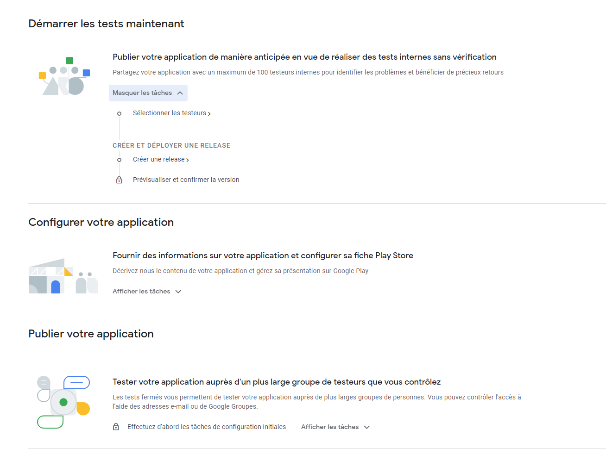

# Deployment

The [Play Console](https://accounts.google.com/ServiceLogin?service=androiddeveloper&passive=true&continue=https%3A%2F%2Fplay.google.com%2Fconsole%2Fdeveloper%2F) is the tool provided by Google to publish and manage Android application on the Play Store.

To be able to connect to the Play Console and publish applications, one needs to have a gmail account and pay 25$ (one time payment).

Then it's free to publish as many apps as one wants. If apps have paid options, Google will take 15% of the income (30% after 1 million dollars per year).

For this course, we hope to be able to provide you an account managed by the school. If it's not possible, we will not ask you to publish your application.

Once your app is created, you will see this checklist:

**For this course, we only ask you to publish the app in internal testing (first section of the checklist), so that you can quickly see the general idea.**

If you want to go further, you can publish your app publicly to the PlayStore by following the entire checklist, we can guide you through this process if you are interested.