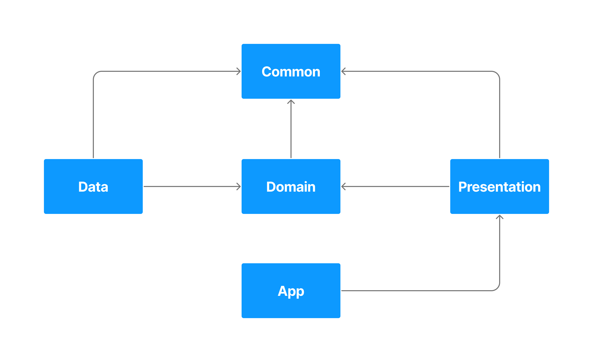

# App Architecture

It's now time to present the architecture we are currently using, which follows the *SOLID* principles as much as it is reasonably possible given the current Android paradigms. This is done by splitting the codebase into several Gradle sub-modules and by limiting the visibility between these sub-modules

*Below is a simplified representation of the architecture where the arrows represent the dependencies betweens modules.*

*For example:*
- *`App` sees `Presentation` but `Presentation` doesn't see `App`.*
- *`Data`, `Domain` and `Presentation` all see `Common`, but `Common` sees nothing.*

## Modules 

### Common
#### Responsibilities 👔

- Contains helper classes, methods, and constants, which are relevant to other modules

#### Visibility 👁️

- Is visible by all the other modules

### Data
#### Responsibilities 👔
- Contains the classes responsible for handling the raw IN/OUT data handling
    - E.g. network calls, database storage
- Contains the implementation of interfaces declared in the `Domain` module

#### Visibility 👁️
- Has visibility only on `Domain` and `Common`

### Domain
#### Responsibilities 👔
- Contains the classes responsible for transforming the raw data into workable business entities, and for applying business rules on the data  
- Declares the interfaces that the `Data` module will have to implement  
- Declares the interfaces that are visible by the `Presentation` module, and which it implements  

#### Visibility 👁️
- Has visibility only on `Common`

### Presentation
#### Responsibilities 👔
- Contains the classes responsible for showing and updating the UI
- Calls the `Domain` module on User actions (app startup, user interacting with the app) and updates according to what is returned by the `Domain` module

#### Visibility 👁️

- Has visibility only on `Domain` and `Common`

### Application
#### Responsibilities 👔
- Contains the technical code required for setting up the Android application

#### Visibility 👁️
- Has visibility only on `Presentation`

