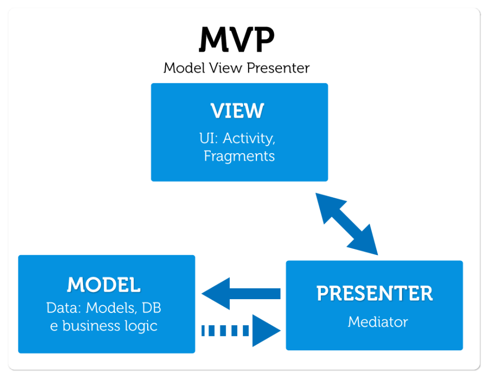

# View Architecture

When talking about "view architecture", what we are referring to is how the the "User interface" part of the codebase interacts with the business logic and data recovery parts. While in theory it is entirely possible to code your entire application in one class file (check out of the files from the [Telegram app](https://raw.githubusercontent.com/DrKLO/Telegram/master/TMessagesProj/src/main/java/org/telegram/ui/ChatActivity.java)), it is considered best practice to split into multiple files the code responsible for displaying a view. 

For instance, an overly simplified version of this is to have: 
- one class which handles loading and updating UI elements
- one class which waits for specific events (i.e. view needing to load for the first time, or the user clicking a button), applies the necessary business logic, and tells the other class what needs to happen

Something like this also helps to apply SOLID principles: 
- (S) - each class only has a specific job to do 
- (O) & (L) - communication between the two classes is usually done via interfaces, the implementation of which is not important to the other class
- (I) - ideally, the interfaces between the two classes contain the bare minimum of methods required for communication, with nothing superfluos between them
- (D) - all of this helps to ensure as loose a coupling as possible between the "UI" class and the "Logic" class. The added benefit of this is that if we want to unitarily test either of the layers, we can replace the other layer with a mocked version which provides all the test values we require to exhaustively test out our code

Let's quickly go over some of the common view architecture paradigms which are common in Android development: 

## MVC - Model - View - Controller 

In the MVC pattern, we distinguish: 
- The **View** - this refers to the XML layouts, as well as the UI component custom classes, responsible for the actual UI rendering
- The **Controller** - this refers to the Activies and Fragments of your app, responsible for the application logic, responding to user interaction, and updating the Model
- The **Model** - this refers to the layer which handles and stores application data, implements business rules, and communicates with the data layer (e.g. databases, network calls)

The data flow between the 3 components does not enforce strict limits, and is usually circular and bi-directional: 
- The **View** can inform both the **Controller** and the **Model** of events
- The **View** can receive instructions from the **Controller**, but also in some cases directly from the **Model**
- The **Model** can get updated by both the **Controller** and the **View**

This lack of strictness means that it can get hard to pinpoint a single source of truth when trying to determine what the UI state should be - in practice it happens that all 3 layers contribute something to the state of the UI, with default elements from the **View**, app logic applied from the **Controller** independantly of any other business rules, and data coming in from the **Model** layer. 

This architectural pattern is considered obsolete for Android development currently, and usually has already been replaced by one of the following patterns

## MVP - Model - View - Presenter

In the MVP pattern, we distinguish: 
- The **View** - this refers to the UI layer as a whole, the XML layouts, the custom UI component classes, and the Activities and Fragments. In this pattern, the "intelligence" of this layer is limited to only calling a method of the **Presenter** when there is an interface action (UI or lifecycle driven)
- The **Presenter** - this refers middle-man layer between the **View** and the **Model**. It retrieves data from the Model and returns it formatted to the View. But unlike the typical MVC, it also decides what happens when you interact with the View
- The **Model** - as for MVC, this refers to the layer which handles and stores application data, implements business rules, and communicates with the data layer (e.g. databases, network calls)

The data flow between the 3 components in this pattern is more strictly enforced compared to MVC. We thus have: 
- The **View** interacts only with the **Presenter**, sending out events and receiving instructions about how to update itself
- The **Model** is only ever called by the **Presenter**, when data is required
- The **Presenter** interacts with both the **View** (receiving calls, and sending updates) and the **Model** (requesting data, and in some cases getting updates spontaneously from it - usually from background tasks

Compared to MVC, we can see that this pattern improves upon the responsability for the state of the UI, with the **Presenter** being the sole responsible for updating the **View**, based upon its own and the **Model's** rules. 

However, a big drawback of this pattern is that it increases the coupling between the **View** and the **Presenter**. The **Presenter** has to provide explicit methods to be called by the **View**, and conversely the **View** provides methods so that it can get updated. This is mitigated by using interfaces for at least the **View** if not for the **Presenter** as well, but the issue remains that the **Presenter** has to know what the **View** "looks" like and it is not easy to reuse a presenter for a different view. 

While not state of the art, this pattern can still be found on some legacy projects. In order to address the coupling issue, the following patterns have been proposed

## MVVM - Model - View - View Model

In the MVP pattern, we distinguish: 
- The **View** - as in MVP, this refers to the UI layer as a whole, the XML layouts, the custom UI component classes, and the Activities and Fragments. Similar to MVP, this layer is limited to sending events (user or lifecycle driven) to the **View-Model**, and updating when the **View-Model** tells it to. The difference is that, whereas in MVP the **Presenter** had to call explicit methods on the **View**, for **MVVM** it is the **View** which subscribes to a data flow provided by the **View-Model**. The "intelligence" of this layer is limited to only calling a method of the **Presenter** when there is an interface action (UI or lifecycle driven)
- The **View-Model** - this refers middle-man layer between the **View** and the **Model**. Similar in function to MVC or MVP, it retrieves data from the Model and returns it formatted to the View. However, the way this is done is by providing a flow of data to which the **View** will subscribe to, and posting events to that flow. This has the advantage of further decoupling the **View** and the **View-Model**, and removing the obligation of implementing interface methods which might be unnecessary when trying to reuse **View-Models** between different **Views**
- The **Model** - as for MVC, this refers to the layer which handles and stores application data, implements business rules, and communicates with the data layer (e.g. databases, network calls). In contrast to MVP and, in part, because of the way the **View** subscribes to the **View-Model** in a reactive way, the model as well tends to be implemented following reactive programming principles (i.e. providing a flow of data to which a receiver will subscribe, instead of just directly returning the data to the method caller)

The data flow between the 3 components in this pattern is a further refinement of MVP, with the added notions of reactive programming being ingrained in the pattern itself. We thus have: 
- The **View** interacts only with the **View-Model**, sending out events and registering an observer to await events from the **View-Model** about how to update itself
- The **Model** is only ever called by the **View-Model**, when data is required. In most cases, the data is returning asynchronously and usually involves the same observable <> observer principle. 
- The **View-Mdoel** interacts with both the **View** (receiving calls, and sending updates) and the **Model** (requesting data, and  getting updates asynchronously)

Compared to MVC & MVP, we can see that this pattern further improves upon the responsability for the state of the UI, with the **View-Model** being the sole responsible for updating the **View**, based upon its own and the **Model's** rules. However, depending on the actual implementation, there is an intrinsic lack of a *Single source of truth* - the **View-Model** can send out multiple independent events to the **View** for it to update, and it can be hard for the **View** to be reconstituted, or for a previous state to be reinstated. The MVI - Model-View-Intent (more info [here](https://medium.com/huawei-developers/stateful-android-apps-with-mvi-architecture-model-view-intent-d106b09bd967)) - pattern tries to improve on this, having a class being responsible for maintaining the state of the view

Another part where MVVM improves upon previous patterns is that it further decouples the 3 elements - the **Model** and **View-Model** each expose observable sources of data which the **View-Model** and **View** respectively connect to. Interfaces are also used to allow injecting the corresponding **Model** and **View-Model** implementations, which also improve on isolating specific elements of the application and allows for writting actual *unitary* tests. All this decoupling and interface usage means that the actual implementations have to be provided in some manner - which is a good enough excuse to talk about dependency injection, on the next page:) 

