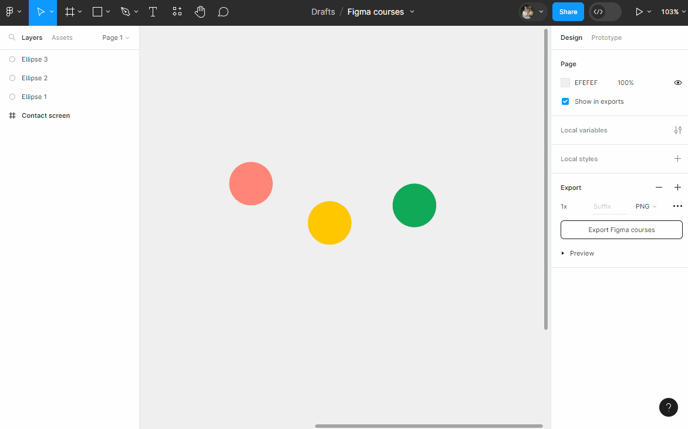
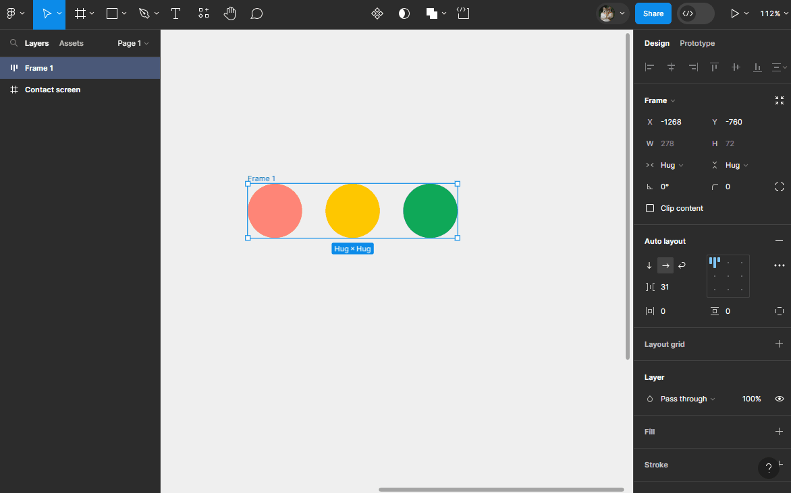

# Element Arrangement

## Direction

Autolayout sequences elements inside a `Frame` one after another (this is also referred to as stacking). The direction of stacking can be either:
- **Vertical**
- **Horizontal**
- **Wrap**

**Exercise:** Create an autolayout and change its direction! To do this:
- Create three circles with different colors (as seen in the image above)
- Select all three circles (hold <kbd>Shift</kbd> + click, or use quick select)
- Use the shortcut <kbd>Shift</kbd> + <kbd>A</kbd> OR click on the button  in the `Design panel` on the right (under `Autolayout` property) to create an autolayout.

> **Note:** You could have also first created a frame, added the three circles inside, and only then applied the autolayout!

- Change the direction of your autolayout (Vertical, Horizontal, Wrap) in the `Design panel` under the `Autolayout` section.

::: details Tutorial 🎥

:::

## Stacking Order

With `Autolayout`, if elements have a negative spacing (overlapping elements), by default, the last element in the `Frame` appears on top. You can change the stacking order of elements by clicking on the button  in the `Autolayout` property ➡ `Canvas stacking`:
- **First on top**: the first element in the stack will be on top
- **Last on top**: the last element in the stack will be on top

::: details Demo 🎥

:::

> **Note:** You can change the position of an element within an autolayout using the arrow keys after selecting it!

**Exercise:** Add / Remove / Hide / Move elements in an autolayout
- Add a fill color to your `Frame` (the one containing the three circles) with the `Fill` property so we can see it clearly and better understand its properties
- Create another colored circle on the canvas (outside your `Frame`)
- Select it and drag it between two elements in your `Frame`
- Use the keyboard arrows to change its position
- You can delete it by pressing <kbd>Backspace</kbd> or <kbd>Delete</kbd>
- (<kbd>Ctrl</kbd> + <kbd>Z</kbd> to undo) hide the element by clicking on  on the right in the `Design panel` under the `Layer` property.

> **Note:** The size of the `Frame` adapts to its content by default
- You can make the hidden element reappear from the 'Layers panel' on the left or by clicking on 

::: details Tutorial 🎥

:::
- Try redoing the exercise while changing the spacing between elements (`Gap between items`)  still in the `Autolayout` properties.

## Absolute Position

Absolute position takes an element out of the autolayout stack while keeping it within the `Frame`. The element and its surroundings ignore each other even if you resize or move them.

Similar to CSS (<code>position: absolute;</code>), an absolutely positioned element can be placed precisely where you want it relative to the parent container (the `Frame`).

Elements in absolute position are managed as in classic `Frames` (without autolayout): you can apply constraints to define their behavior when the parent `Frame` is resized.

To activate the absolute position of an element, select a child of a `Frame` with `Autolayout` and click on 

::: details Demo 🎥

:::