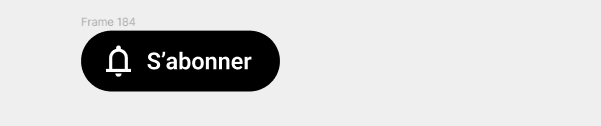
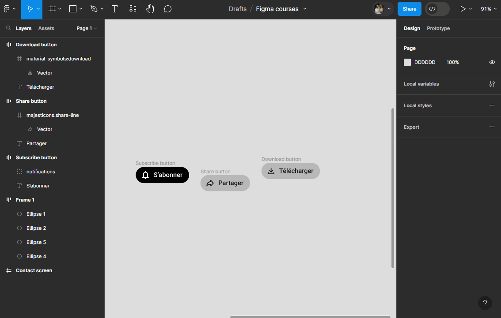

# Resizing

## Hug Contents
One of the most powerful features of autolayout is to adapt the dimensions of its `Frame` based on its contents!

You might have already noticed, when you add an element to a `Frame` with `Autolayout`, its size adjusts! This happens because, by default, the `Horizontal resizing` and `Vertical resizing` properties are set to `Hug contents`.

::: details Demo 🎥

:::

**Exercise:** Create YouTube's `Subscribe` button!

::: tip 🎯 Goal: Smart Button
A practical case of autolayout—you're going to create a button that adapts to the size of its text.

:::
- Create a text label "Subscribe"
- Select your text and press <kbd>Shift</kbd> + <kbd>A</kbd> to create an autolayout from it.

>**Note:** Your text is now contained in a `Frame` with `Autolayout`
- Modify the text and the `Frame` as follows:
  - text color: white
  - text size: 16 pixels
  - text height: 24 pixels
  - background color of the `Frame`: black
  - `Gap` of the autolayout: 8 pixels
  - `Padding` of the autolayout (top, right, bottom, left): 8, 16, 8, 12
  - Change the `Frame`'s `Corner radius`: at least 20 pixels
- Ensure the `Frame`'s `Horizontal resizing` property is set to `Hug contents`
- Add a "bell" icon inside the `Frame` and position it before the text
- Try modifying the text and notice how the `Frame` size adapts.

::: details Demo 🎥

:::

## Fixed Width and Height
If you enter a fixed value for `Horizontal resizing` and/or `Vertical resizing`, the size of the `Frame` will no longer adjust to the content.

## Fill Container

If `Horizontal resizing` and `Vertical resizing` are fixed, you can still resize the elements inside the `Frame`!

With the `Fill container` option, the element will fill all the available space inside the `Frame`!

>**Note:** Here you need to select the element inside the `Frame` to apply the `Fill container` option for `Horizontal resizing`. Remember: double-click until you reach the desired element, or press <kbd>Ctrl</kbd> + click to select it.

**Exercise:** Try the Fill container option
- Create two more buttons (Share and Download) based on the first one
- Select all three buttons and press <kbd>Shift</kbd> + <kbd>A</kbd> to create an autolayout
- Add a spacing value between and around the elements (`Gap`, `Padding`)
- Add a background color to your `Frame` with `Autolayout` to better see it and understand the behavior
- Extend the width of your `Frame` (which contains your buttons) to a fixed value (`Horizontal resizing`)
- Select one button and apply the `Fill container` option to it
- Try resizing the `Frame` in width and observe the button (its size adjusts in width)

::: details Tutorial 🎥

:::

- Apply `Fill container` to all the buttons in the `Frame`, then try resizing it in width
- Try changing its direction (vertical/horizontal)

::: details Demo 🎥

:::

## Minimum and Maximum Dimensions

You can set a maximum and/or minimum for the width and height of a `Frame` with `Autolayout`. To do this:
- open the dropdown for the width (`Width`) to find the options  `Add min width` and  `Add max width`
- open the dropdown for the height (`Height`) to find the options  `Add min height` and  `Add max height`

**Exercise:** Maximum and minimum width!
- Add a maximum width (250px) and a minimum width (170px) to the `Subscribe` button
- Try resizing the button beyond these dimensions

::: details Tutorial 🎥

:::