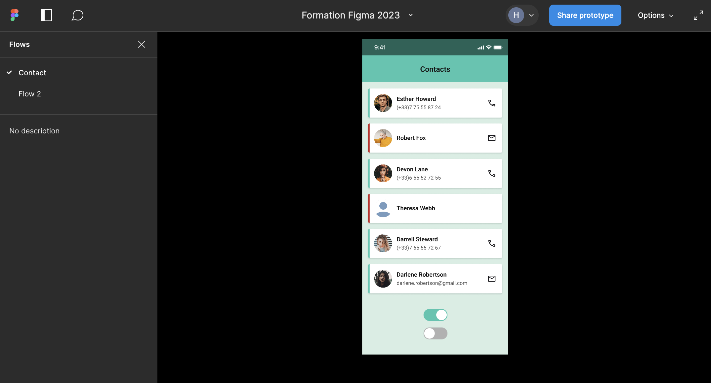
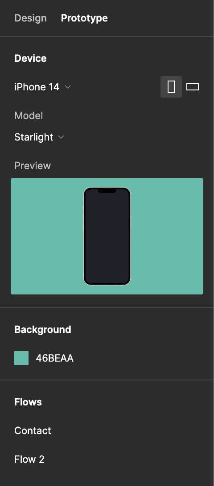

# Prototyping

## What is it?

Prototyping allows you to create interactive `flows` within your designs to bring them to life. Prototypes are built by establishing `connections` between objects.

Each connection is composed of a trigger (what initiates the interaction) and an action (the result).

::: tip Prototype Menu

To switch to prototyping mode, select the `prototype` tab from the design panel.

In this mode, your interactions with elements on the canvas will change. If you want to make changes to your screens, you'll need to switch back to "design" mode.
:::

## Flows and Starting Points

Prototyping allows you to create multiple interaction flows. A flow (or scenario) is a journey consisting of frames connected to one another. It is always attached to a frame and can be renamed.

The `starting point` of the flow is automatically added when a first connection is made between two screens; it can also be added manually from the `prototype` tab.

Each flow has a starting point corresponding to the first screen of each scenario. It is created automatically when a connection is established between 2 screens/frames. You can also create it yourself from the prototype panel by selecting a frame.

If several flows are created on the same Figma file page, they will all be accessible from the prototype presentation mode.

## Connections

In `prototype` mode, selecting a frame or an object allows you to add one or more connections represented by: 

Upon clicking, a configuration menu for the connection point appears where you must specify the trigger, the destination, the type of transition, and in the case of an animated transition, the speed and duration settings.

When connected, the connection point takes the form of an arrow between the frames it links.

<!--INSERT SCHEMA ON SCREEN-->

### Triggers

These actions define how the connection between the two screens or objects will be triggered.

The trigger is active in the area where the connection point is created, meaning that linking a screen from the frame or from an element inside the frame will change the starting point of the trigger.

(for example, scenario 1 with frame to frame and scenario 2 with shape to frame)

### Interaction Types

All interactions other than `instant` create an animation transition between screens/objects, and you must then define an animation style and its duration.

The most common animation is smart animate, which animates the transition of elements already present in the first screen to the second one.

::: warning Attention
Naming your elements is important; a transition with smart animate will not work if the element has a different name than in the first screen.
:::

## Presentation Mode

Presentation mode allows you to "play" the flows created through the connections.

`Present` opens the flows in a new full-screen window, while `preview` allows you to view the prototype directly from the current page, which is handy for editing screens in parallel.

::: tip Tip
The shortcut for `preview` display is <kbd>Shift</kbd>+<kbd>Space</kbd>.
:::

## Configuring Presentation Mode

From the prototyping panel, you have access to several presentation settings:

- Adding a mockup device
- Modifying the background of the presentation
- Managing flows

