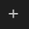
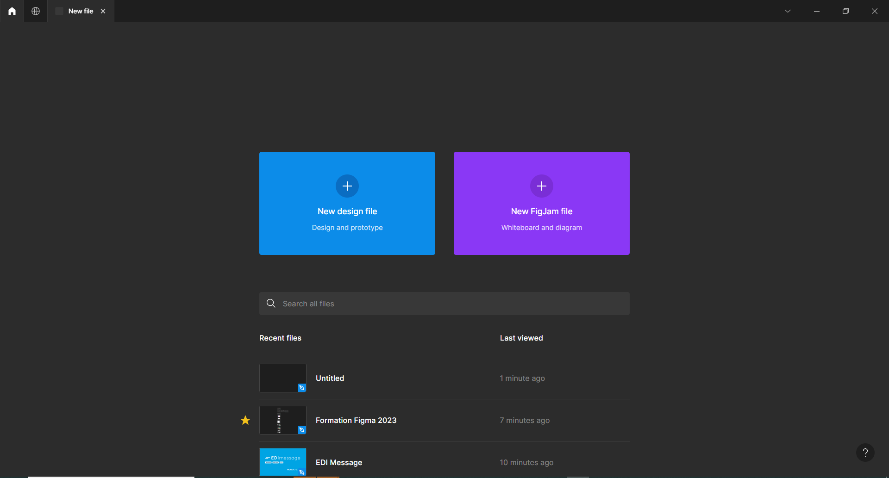
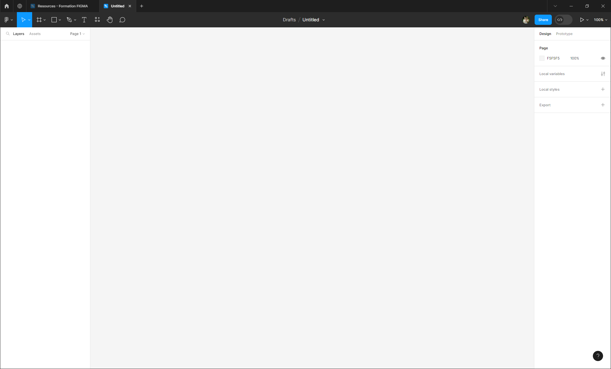
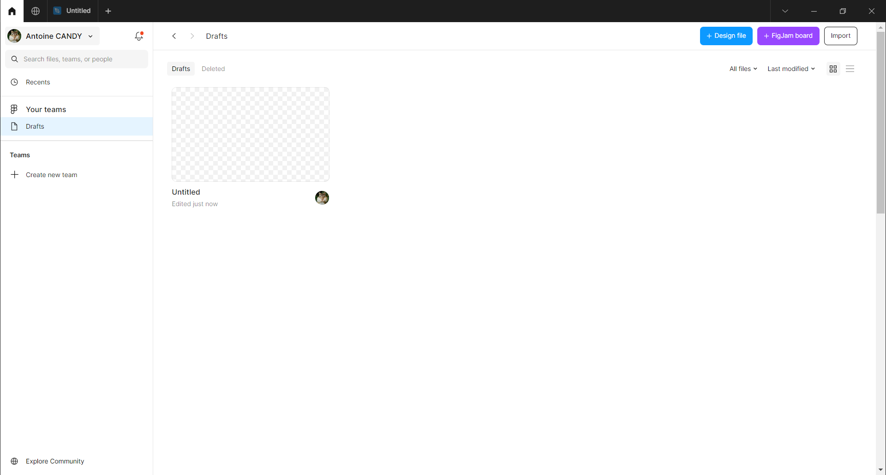
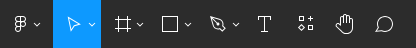
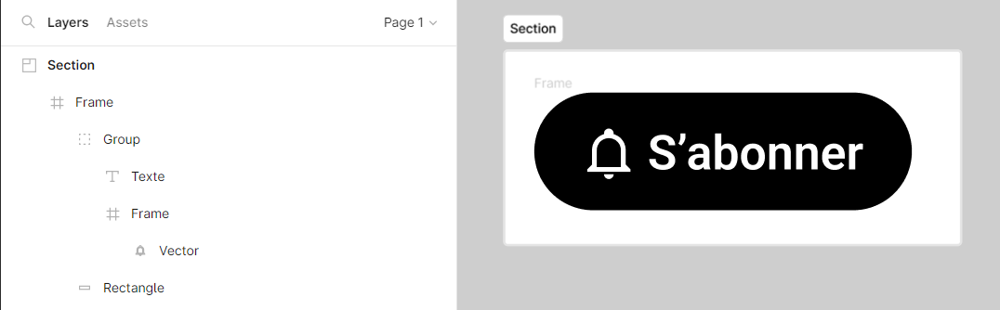

# Global Interface

## Create a New File

To create a new file, launch Figma and open a new tab by clicking on the button  at the top of the screen. Then click on `New design file` (as shown in the following image).

A new window appears, representing a new Figma file (currently empty).

Your file is now saved to your personal Figma space. It is accessible by clicking on the home button  in the top left of the screen in the `Drafts` menu.

## Global Interface

The Figma interface is divided into 4 sections (A, B, C, and D) that we will describe.

###  The Toolbar
 

Divided into three parts:
- on the left are the creation tools

- in the middle, the Figma file options

- on the right, the sharing tools

::: tip Rename Your File (Windows/MacOS) 💡
You can immediately rename your Figma file by clicking on its name.

::: details Tutorial 🎥

:::

###  The Canvas

This is where we create and view interface elements using tools available in the `Toolbar`. This space is empty because nothing has been created yet.

###  The Design Panel

Here you will find the properties of the element selected on the `Canvas`. Currently, nothing is selected, and by default, you see the properties of the canvas itself (e.g., the background color of the page).

**To do:** You can change the background color of the page by clicking on the colored square.

::: details Tutorial 🎥

:::

###  The Layers Panel

This panel shows the hierarchy of the design (interface elements on the canvas). As soon as an interface element is created on the `Canvas`, it is listed here according to its position.

> **Note:** Each design element is called a `Layer`. There is a variety of layer types (text, rectangle, group, frame, image, section, vector, etc.). It is with these different elements that we will build interface elements.

This is what the `Layers Panel` might look like for a button created on the `Canvas`:

You can rename layers for better organization:

