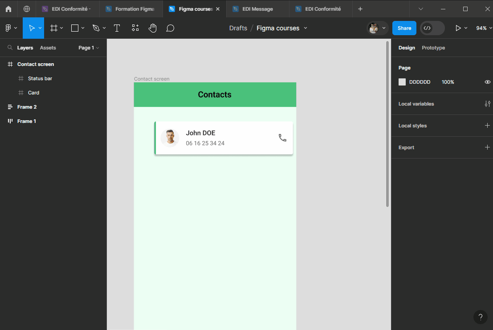
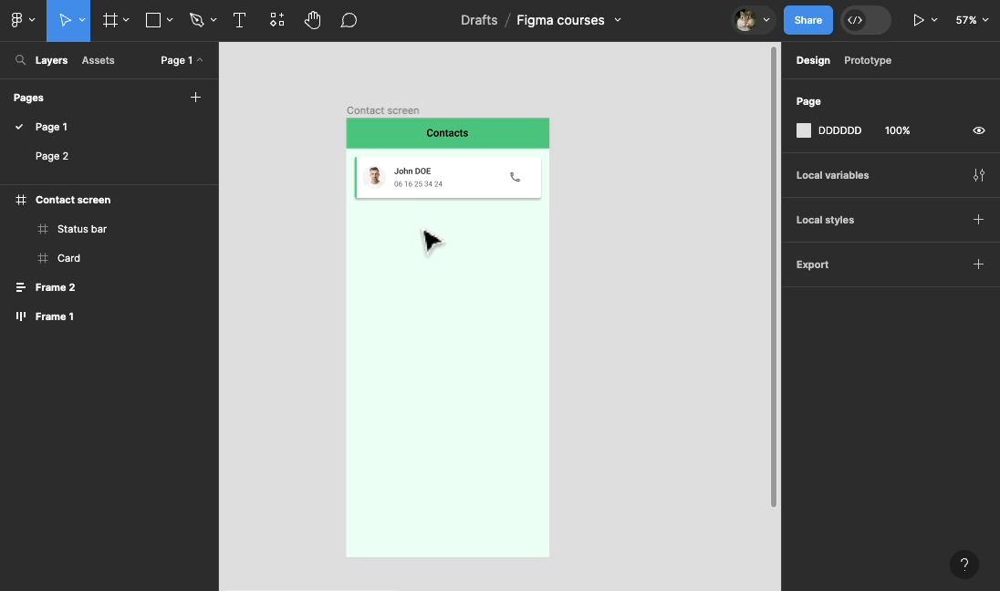

# Positionnements

::: tip 🎯 Objectif : Positionner correctement les éléments entre eux au pixel prêt !

:::

## Alignements

### Aligner un élément dans un conteneur

Comme nous l'avons déjà vu, Figma permet d'aligner (à gauche, à droite, en haut, en bas, au centre) un élement à l'interieur de son conteneur (`Frame`, `Groupe`, `Section`) :
- directement dans le plan de travail (aides visuelles de Figma)
- à l'aide des boutons d'alignements en haut à droite du `Design panel`

::: details Tutoriel 🎥

:::

### Aligner plusieurs élements

Pour aligner des éléments les uns par rapport aux autres vous pouvez :
- déplacer les éléments un par un en utilisant les aides visuelles de Figma
- les sélectionner tous, puis utiliser les boutons d'alignements en haut à droite du `Design panel`

::: tip Sélection en profondeur & mutli-sélection 💡

Pour sélectionner un élément à l'interieur d'un autre (groupe, frame) : 
- soit double-cliquer jusqu'à atteindre l'élement
- soit maintenir la touche <kbd>Ctrl</kbd> enfoncée puis cliquer sur l'élément

Pour sélectionner plusieurs éléments à la fois : maintenir <kbd>Shift</kbd> enfoncée et cliquer sur les éléments un par un

Utilisez <kbd>Ctrl</kbd> + <kbd>Shift</kbd> enfoncées pour faire de la multi-sélection en profondeur !

:::

**Exercice :** Aligner éléments dans votre `Card` contact
- Alignez vos textes `Nom` et `Numéro` (justifiés à gauche)
- Groupez-les dans une `Frame` (<kbd>Ctrl</kbd> + <kbd>Alt</kbd> + <kbd>G</kbd>) et renommez cette `Frame` en `Contact info`
- Centrez horizontalement vos trois éléments de contact (photo, contact info et l'icône)

::: details Tuto 🎥

:::

## Espacements
La dernière étape pour positionner correctement vos éléments est de leur appliquer les bons espacements autour et par rapport aux autres !

Il est important pour avoir un design ordonné, cohérent et propre d'avoir des espacements identiques/proportionel et précis. Il est donc normal pour les designers d'interface de positionner ses éléments d'interface au pixel prês !

::: tip Déplacer un élément au pixel près !💡
Pour déplacer un élément pixel par pixel dans Figma : sélectionnez votre élément puis utilisez les flêches directionnelles du clavier !

Pour déplacer un élément d'un **certains nombre** de pixel d'un seul coup (on parle de `Nudge`), maintenez <kbd>Shift</kbd> enfoncée puis piloter le déplacement avec les flèches directionnelles <kbd>↑</kbd>, <kbd>↓</kbd>, <kbd>→</kbd>, <kbd>←</kbd> ! 

Par défaut cet écart est de 10 pixels, il est possible de changer cet écart dans les options de Figma `Fichier` > `Preferences` > `Nudge amount...`

:::

>**Remarque :** Si vous zoomez à fond (<kbd>Ctrl</kbd> + <kbd>Roulette</kbd>) sur le plan de travail, vous finirez par voir les pixels de votre design ! Une aide en  plus pour un design au pixel près !

::: tip Visualiser les espacements 💡
Utilisez <kbd>Alt</kbd> pour voir l'espacement entre l'élément et les bordures de l'écran
:::

**Exercice :** Positionner votre `Card` de contact au pixel près !
- si vous ne l'avez pas encore fait, changez le `Nudge amount` de votre projet (`Fichier` > `Preferences` > `Nudge amount...`) en saisissant la valeur 8
- dans l'écran de contact, positionnez votre contact tout à gauche au bord de l'écran juste en dessous de votre barre de statut
- décallez le de 16px à droite avec <kbd>Shift</kbd> + <kbd>→</kbd> puis de 16px vers le bas (<kbd>Shift</kbd> + <kbd>↓</kbd>)
- aggrandissez ensuite la `Frame` de contact pour qu'elle soit à 16px à droite de l'écran (vous pouvez pour cela aggrandir la `Frame`jusqu'au bord de l'écran puis soustraire le nombre de pixel souhaité à la largeur `Width`)

::: details Tuto 🎥

:::

**Exercice :** Aligner plusieurs contact
- Duppliquez votre `Card`de contact deux fois

::: tip Duppliquer un élément
Pour duppliquer un élément dans Figma, vous pouvez sélectionner votre élément puis :
- utiliser les raccourcis clavier <kbd>Ctrl</kbd> + <kbd>C</kbd>, pour copier, puis <kbd>Ctrl</kbd> + <kbd>V</kbd> pour coller
- utiliser le raccourci <kbd>Ctrl</kbd> + <kbd>D</kbd> pour copier/coller directement
- maintenir <kbd>Alt</kbd> enfoncée, maintenir le clique sur votre élément puis glisser votre cursor en dehors de celui-ci
- utiliser le clique droit (copier puis coller)
:::

- Alignez vos `Card` de contact verticallement (justifiées à gauche)
- Espacer vos `Card`de contact les unes des autres de 16px

::: details Tuto 🎥

:::

## Grilles

Les grilles sont des outils de mise en page facilitant le positionnement des différents éléments qui composent nos pages.
Si vous designez pour du format web, elles peuvent être particulièrement utiles pour créer des designs `responsives` mais sont également utiles pour du format tablette ou mobile.

**Les grilles sont applicables uniquement sur les `frames`**

Il existe 3 éléments associés aux `layout grid` : les grilles, les colonnes et les lignes.

Pour créer un `layout grid`, sélectionnez une frame puis accédez à la section `layout grid` depuis le `panneau de conception`.

Vous pouvez créer 3 layouts différents :
- **les grilles** (statiques, ne dépendent pas de la taille de la frame)
- **les colonnes**
- **les lignes**

Il y a 4 types d'alignement de colonnes et de lignes :

- Stretch (la taille des colonnes est automatique pour s'ajuster à la frame)
- Center
- Left
- Right 

Il est possible d'ajuster les tailles des colonnes et lignes, mais aussi des `gouttières` et des `marges`.
Une `gouttière` correspond à l'espace entre les lignes ou colonnes.
La `marge` correspond à l'espace aux extrémités des lignes ou colonnes.

<!--INSERER SCREEN SCHEMA DE L ECRAN FORMATION AVEC INDICATIONS GRILLES-->
