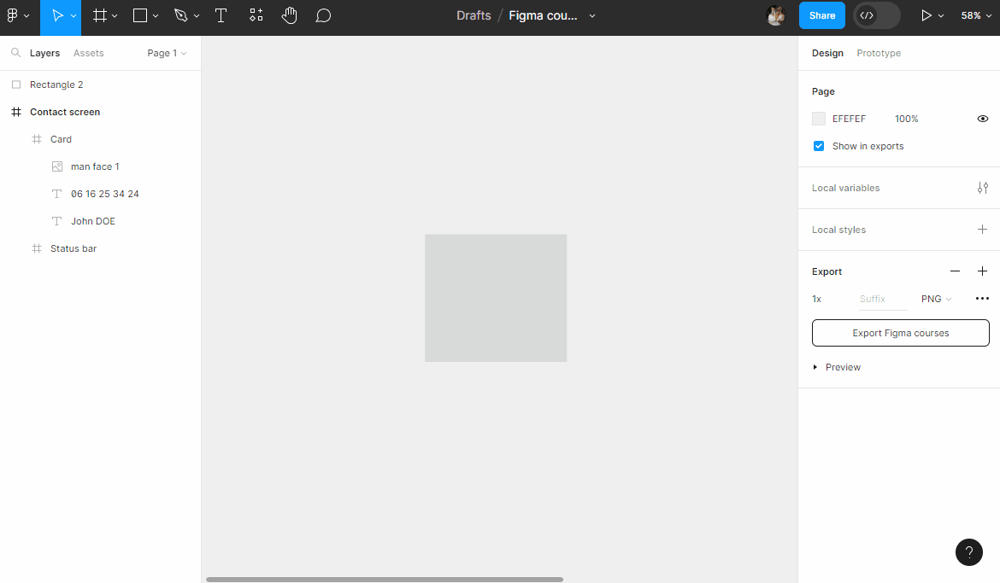

# Shapes

## Rectangle
In the `Toolbar`, select the `Rectangle` shape tool, and draw a rectangle on the `Canvas` next to your text.

Once created and selected, you can modify its properties (e.g., change its color).

::: details Tutorial 🎥

:::

> **Note:** It is possible to change certain properties of your rectangle directly on the canvas (dimensions, rotations).

::: details Tutorial 🎥

:::

You have other tools available to create shapes (lines, arrows, ellipses, etc.).

> **Note:** You can create a custom shape with the `Pen` tool . Simply create a closed path and modify its properties (colors, borders, etc.).

## Shortcuts

### Proportional Resizing 💡
To create a perfect circle using Figma's Ellipse tool, hold down the <kbd>Shift</kbd> key while drawing.

The same applies to making a square with the Rectangle tool.

More generally, consistently hold down the <kbd>Shift</kbd> key when you want to resize your elements proportionally.

::: details Tutorial 🎥

:::

### Symmetrical Resizing 💡

You can resize elements symmetrically (relative to the center of the element) by holding down the <kbd>Alt</kbd> key!

::: details Tutorial 🎥

:::

> **Note:** It is possible to combine the two keys <kbd>Shift</kbd> + <kbd>Alt</kbd> pressed simultaneously for proportional AND symmetrical resizing!