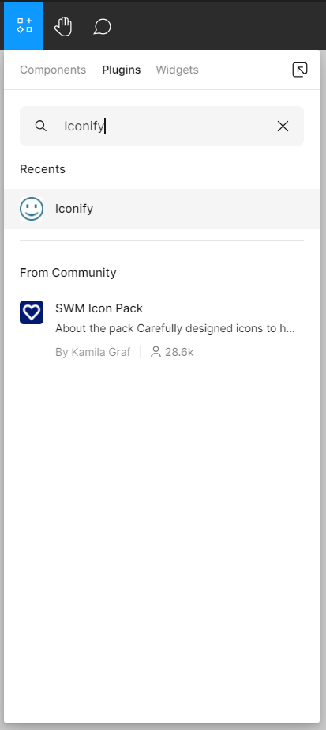

# Icons

To add icons to our design, we could do like with images: search on the internet and import or copy-paste into our canvas (a relatively tedious task).

We can simplify and speed up the process by using an `Icon Plugin`!

> **Note:** Figma has a large number of plugins (developed by the community) that can help us with our design. [Click here](../plugin.md) for more information.

We’ll use the `Iconify` plugin to search for and import our icons. Iconify aggregates the most well-known icon libraries/collections available online (Google Material Symbols, Bootstrap icons, Feather...).

To use this plugin, right-click > `Plugins` > `Manage plugins...`

A window will open. Enter `Iconify` in the search bar, and then click on the first result.

> **Note:** You can also access plugins directly from the `Assets` tool  in the `Toolbar`.

The `Iconify` window appears, you can then:
- Choose an icon library (e.g., Google Material Icons) to have icons with the same graphic style (design consistency)
- Search for an icon (e.g., phone)
- Select the desired icon and click on `Import icon`

The icon will appear on the canvas, you can then close `Iconify` and place the icon into the `Card`

::: details Tutorial 🎥

:::

::: warning Caution
Make sure to select the icon’s frame (outline) and not the vector directly when you move it. The frame is there to properly space the icon from its surroundings.
:::

> **Note:** Unlike an image (PNG, JPG...), the icon is vectorial (`Vector`, see in the `Layers Panel` on the left), so you can change its color and scale it infinitely (without seeing pixels)!

::: tip Reuse a plugin 💡
Save Iconify by right-clicking > `Plugins` > `Manage plugins...` and then click the `Save` button in the search results.

From now on, right-click > `Plugins` > `Saved plugins` > `Iconify`.
:::

> **Note:** You can also manually create an icon in Figma directly with the Pen tool (`Pen`) . Simply create a frame and then draw a shape inside it.