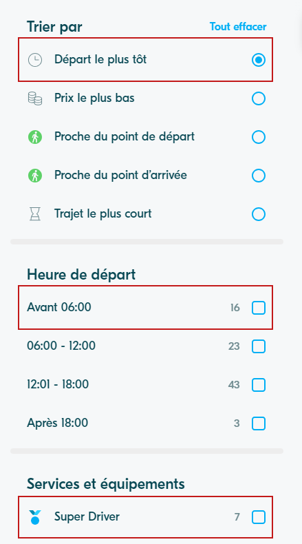
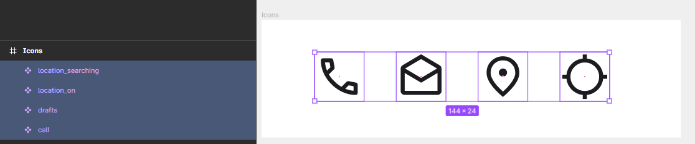

# Liste de filtres

::: tip 🎯 Objectif : Créer la liste de filtres

:::

## Création du composant `Cellule de filtre`
Nous avons ici une problématique typique que l'on retrouve lorsque l'on souhaite créer des cellules: nous avons plusieurs éléments similaires mais pas totalement identiques.

La question se pose alors pour créer ces variations dans le composant : variants ou propriétés ?

Je ne pense pas que la réponse soit tranchée. Cela peut être aussi un mélange des deux. Pour faire ce choix, il faut garder en tête : 

- **La facilité d'utilisation** du composant.
- **La possibilité d'évolution** du composant.
- **La lisibilité du Figma**: est-ce qu'on comprend facilement les possibilités de personnalisation de ce composant ?
- **La cohérence du composant**: parfois nous voulons délibérément interdire certaines combinaisons de paramètres car cela n'aurait pas de sens pour un composant donné.

En prenant cela en considération, essayez de créer votre composant cellule. N'hésitez pas à débattre entre vous des différentes possibilités ;)

::: tip 💡 Gestion des icônes

La meilleure façon de gérer les icônes, est de faire un composant de chaque icône et de mettre tous ces composants dans une même frame.

Vous pourrez ainsi utiliser de manière fluide l'instance swap entre ces icônes dans les propriétés des composants.
:::

## Création de la liste
Une fois le composant cellule créé vous avez fait le plus gros du travail pour créer la liste.

Il reste les headers et les séparateurs à créer, puis à tout intégrer dans des auto-layout.

