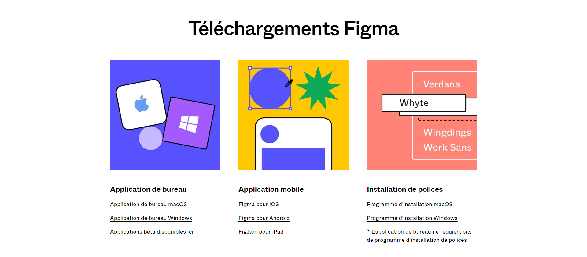

# Download

::: tip Client Figma (windows/macos) 💻

Figma works in your browser, but for a better user experience, we recommend you install the Desktop (client) version, available by clicking on the following link:

[Download Figma](https://www.figma.com/fr/downloads/)

:::

> **Note:** You need a Figma account to use it. Create one! 😉

