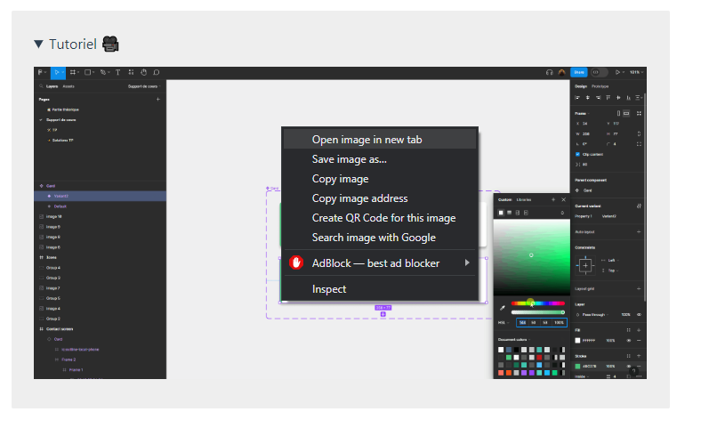

# Training schedule

## The basics 🧱

In this first part you'll be guided through the basics of Figma.

You'll discover Figma's interface in editing mode, the various basic components, how to position them and modify their properties.

::: tip 💡 Tip: open videos

On this site you'll find numerous `Tutorial` sections with explanatory videos.

If the display on the site is too small, we advise you to open them in a new tab to see them larger by doing `right click` -> `Open image in new tab`.

:::

## Advanced features 📚

In this second part you'll be guided through Figma's advanced features.

You'll also learn best practices for creating legible, scalable designs with Figma.

## Exercise 🚀

Finally, we'd like you to try your hand at reproducing a page from a well-known site in Figma 🚙.

We'll break the work down into tasks and give you a few tips, but it's up to you to organize yourself as best you can.