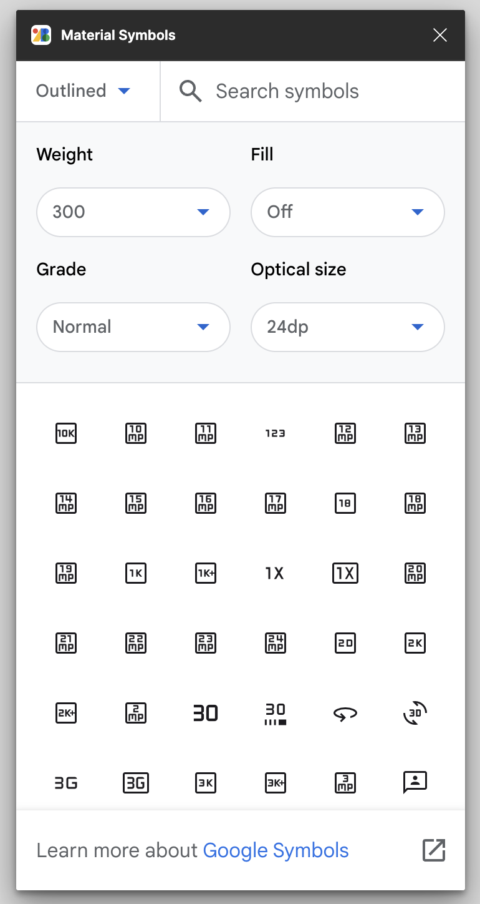
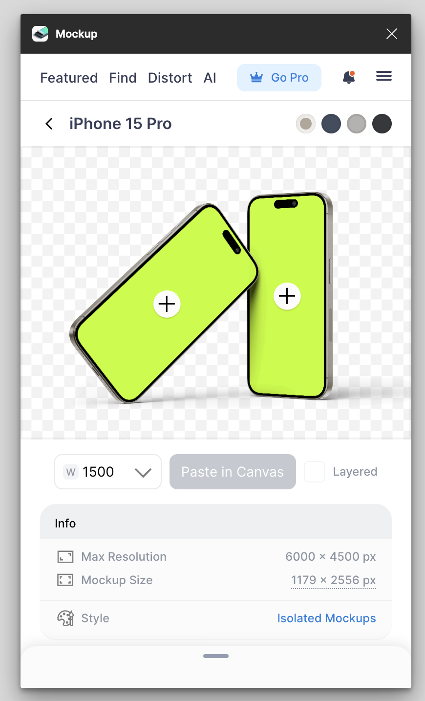
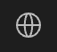
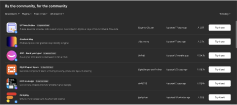

# Plugins

## Qu'est-ce que c'est ?

Les `plugins` dans Figma sont des outils personnalisés qui permettent d'améliorer votre productivité en vous donnant accès à des ressources ou nouvelles fonctionnalités sur Figma.

L'onglet plugin se situe depuis le menu représenté par l'icône 
 de la barre d'outils. Depuis cette interface vous trouverez vos plugins récemment utilisés et une fonction de recherche de plugins.

::: details Suggestions de plugins 🎲

### Unsplash

Unsplash est un site d'images de stock libres de droits, ce plugin permet d'ajouter directement les photos d'Unsplash à vos projets Figma.

### Material symbols

Ce plugin permet d'utiliser les icônes de la bibliothèque Material de Google.

### Mockups

Ce plugin permet de générer des mockups depuis vos frames.

### Contrast

Ce plugin permet de vérifier que contrastes entre les différents éléments de vos designs respectent les normes d'accessibilité (WCAG).

:::

::: tip Découvrir des plugins
Si vous souhaitez rechercher davantages de plugins, privilégiez vos recherches depuis l'onglet communauté 
 

:::

## Les widgets

 Les `widgets` sont des objets interactifs similaires aux plugins. Contrairement à ces derniers qui fonctionnent pour une personne spécifique, tout le monde peut voir et interagir avec le même widget directement depuis la zone de travail.
 
 Vous pouvez ajouter autant de widgets au fichier que nécessaire et même les faire fonctionner en même temps.

 Les widgets sont accessibles depuis le même emplacement que les plugins : 
 

 

