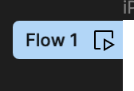
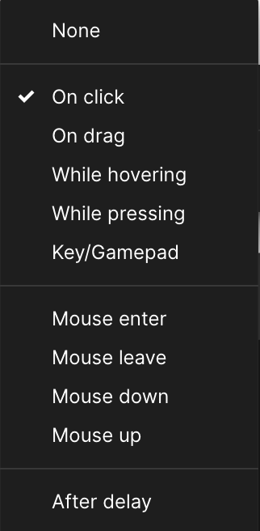
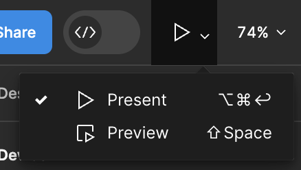

# Prototypes

## Qu’est-ce que c’est ?

Le prototypage vous permet de créer des `flows` interactifs entre vos designs pour leur donner vie.Les prototypes sont réalisés en établissant des `connexions` entre les objets.

Chaque connexion se compose d'un déclencheur (c'est-à-dire ce qui lance l'interaction) et d'une action (c'est-à-dire le résultat).

::: tip Menu Prototype

Pour passer en mode prototypage, il faut sélectionner l'onglet `prototype` depuis le panneau de conception.

Dans ce mode, les intéractions avec vos éléments sur le plan de travail changent. Si vous souhaitez effectuer des modifications sur vos écrans il faudra repasser en mode “design”.
:::

## Flux et points de départ

Le prototypage permet de créer plusieurs flux d’intéractions.Un flux (ou scénario) est un parcours d’enchainement de frames connectées les unes aux autres. Il est représenté de la façon suivante toujours collé à la frame et peut être renommé.

Le `starting point` du Flow est automatique ajouté lors d'une première connexion entre deux écrans, il peut également être ajouté manuellement depuis l'onglet `prototype`.

Chaque flux à un point de départ qui correspond au premier écran de chaque scénario. Il est créé automatiquement lorsqu’une connexion est établie entre 2 écrans / frames.Vous pouvez également le créer vous-même depuis le panneau protype en sélectionnant une frame.

Si plusieurs flux sont créés dans une même page du fichier Figma, ils seront tous accessible depuis le mode de présentation des prototype.

## Connexions

En mode `prototype`, sélectionner une frame ou un objet permet d'ajouter une ou plusieurs connexions représentées par : 

Au click, un menu de configuration du point de connexion apparaît dans lequel il faut indiquer le déclencheur, la destination, le type de transition, et dans le cas d'une transition animée, les réglages de vitesse et durée de celle-ci.

Lorsqu'il est relié, le point de connexion prend la forme d'une flèche entre les frames qu'il relie.

INSERER SCHEMA SUR SCREEN 

### Les déclencheurs

Ces actions définissent comment sera déclenchée la connexion entre les deux écrans ou objets.

Le déclencheur est actif sur la zone où est créé le point de connexion, c'est à dire que relier un écran depuis la frame ou depuis élément à l'intérieur de la frame changera le point de départ du déclencheur.

(exemple 1 avec frame to frame et exemple 2 avec carré to frame)

### Les types d'intéractions

Toutes les intéractions autres que`instant` créent une animation de transition entre les écrans / objets, il faut alors définir un style d'animation et la durée de cette dernière.

L'animation la plus courante est le smart animate, celle-ci permet d'animer la transition des éléments déjà présents dans le premier écran jusqu'au second. 

::: warning Attention
Nommer ses éléments est important, une transition en smart animate ne fonctionnera pas si l'élément possède un nom différent que dans le premier écran.
:::

(vidéos des différentes animations)

### Fonctions de scroll

(PARLER DES FONCTIONS DE SCROLL)

## Mode présentation

Le mode de présentation permet de "lire" les flows créés via les connexions.

Le menu de présentation 
 est accessible tout à droite de la barre d'outils.

`Present` permet d'ouvrir les flows dans une nouvelle fenetre en grand-écran, tandis que `preview` permet de visualiser le prototype directement depuis la page actuelle ce qui est pratique pour éditer les écrans en parallèle.

::: tip Astuce
Le raccourci de l'affichage `preview` est (faire commande touches) Shift + Espace
:::

AFFICHER SCREEN ECRAN + Description actions

## Paramétrer le mode présentation

Depuis le panneau prototypage il est possible de paramétrer le mode de présentation en affichant un mockup d'un device, il est également possible de modifier le fond d'écran sur lequel le protoype apparaît.

