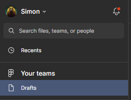
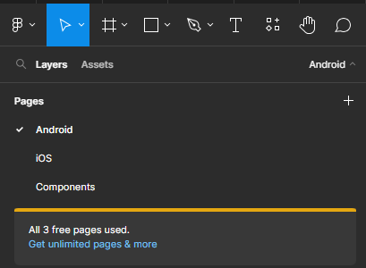
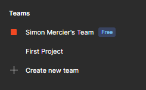

# Mais Figma, c'est payant ?

Ce que l'on peut faire ou non avant chacun des plans de Figma est difficile à comprendre. La gestion des droits depuis le logiciel n'est pas du tout intuitive.

C'est pourquoi nous allons commencer par démystifier cela.

## Drafts

Lorsque vous créez un nouveau `fichier` Figma, il se crée par défaut dans vos brouillons.

En mode gratuit, vous pouvez avoir **autant de `fichiers` que vous le souhaitez** dans vos brouillons.

Il n'y a aucune limite pour inviter des collaborateurs **en lecture seule** dans vos brouillons.

::: danger Limites du mode gratuit

- Vous ne pouvez pas ajouter de collaborateur en écriture.

- Vous êtes limité à 3 pages par `fichier`.

:::

## Teams

Par défaut, Figma vous a créé une `équipe` avec un `projet`.

**Un `projet` est un ensemble de `fichiers` Figma.**

Dans un `fichier` Figma se trouvant dans un `projet` vous pouvez ajouter **autant de collaborateurs que vous le souhaitez en lecture ou écriture**.

::: danger Limites du mode gratuit

- 1 `projet` maximum
- 3 `fichiers` maximum dans ce `projet`

:::