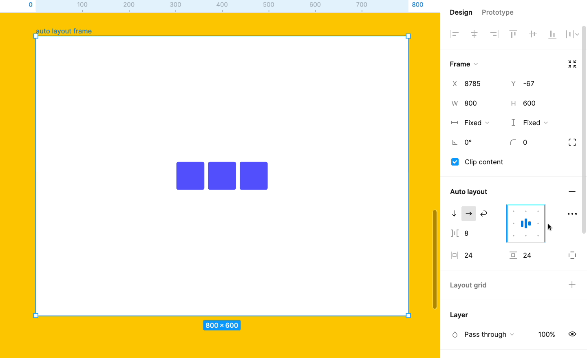
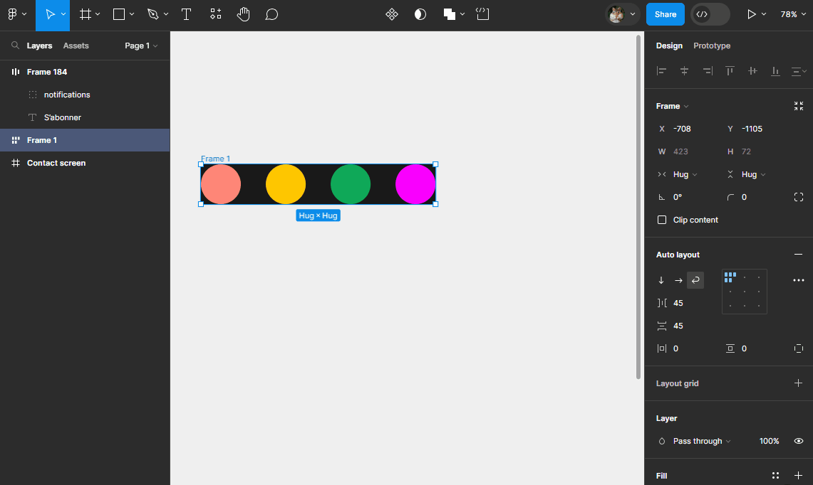

# Alignements

## Alignements des éléments d'un autolayout

La `Direction`et le `Gap`de votre autolayout vont déterminer quelle option d'alignement est possible à l'interieur de celui-ci.

Contrairement aux `Frame`classique, dans une `Frame`avec `Autolayout` vous ne pouvez pas controler l'alignement de chaque élément individuellement. C'est pour cette raison que l'alignement est régler depuis l'autolayout et pas sur chaque éléments !

Utilisez la boite d'alignement dans le `Design panel`à droite dans la propriété `Autolayout` pour changer l'alignement des éléments à l'intérieur de votre `Frame`.

::: details Démo 🎥

:::

**Exercice :** Tester l'alignement
- Agrandissez la `Frame`qui contient vos cercles
- Essayez de changer l'alignement dans la boite d'alignement de votre `Autolayout`
- Changer la direction (Horizontal, Vertical, Wrap) puis testez à nouveau les différents alignements
- Faites de même en changeant le `Gap`  ("Auto" ou bien une valeur en pixel !)

::: details Tuto 🎥

:::