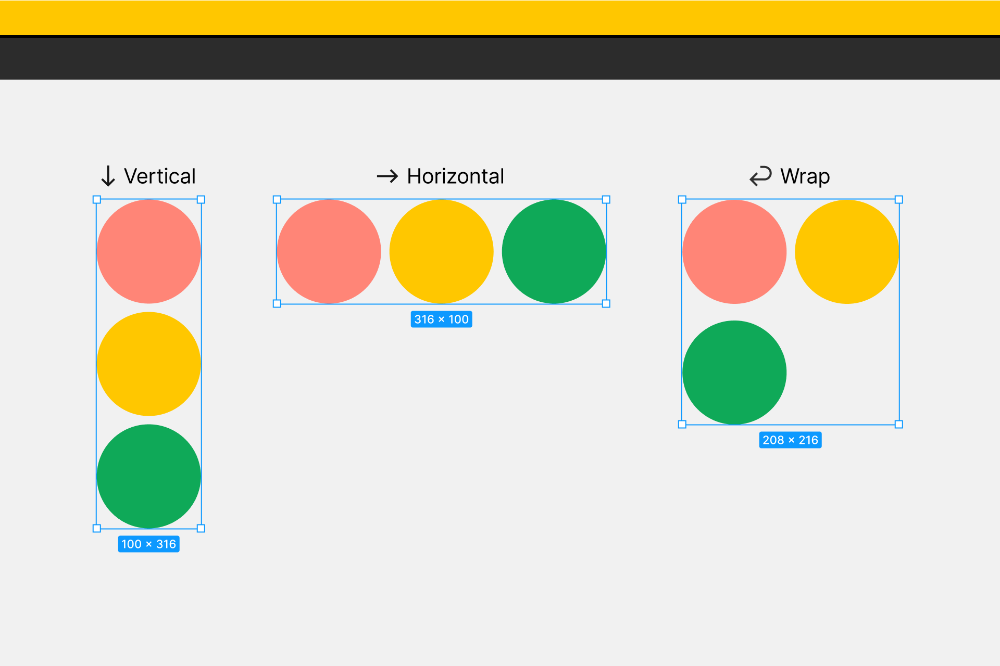
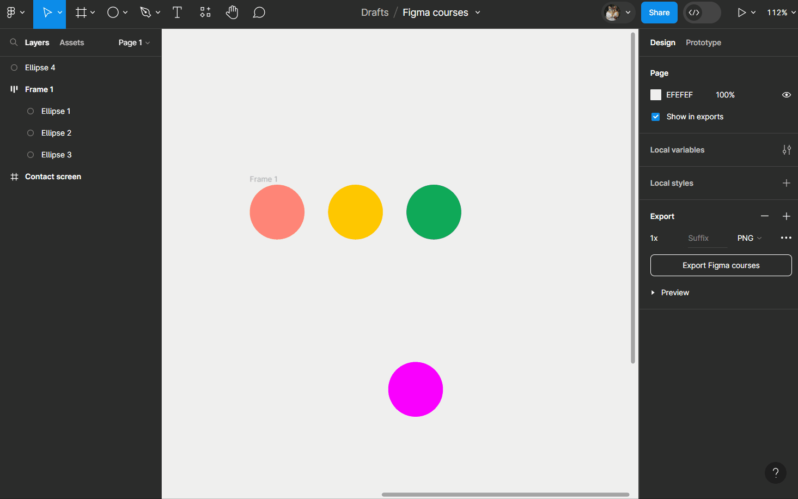
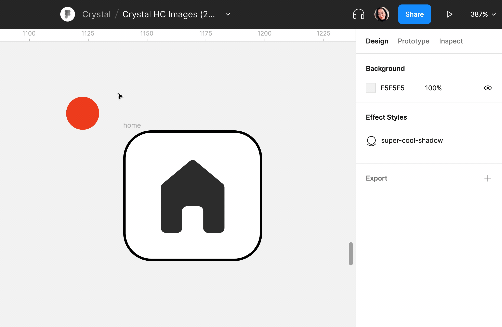

# Agencement des éléments

## Direction

L'autolayout agence les élements dans la `Frame` les uns à la suite des autres (on parle aussi d'empilement). La direction de l'empilement peut être soit :
- **Vertical**
- **Horizontal**
- **Wrap**

**Exercice :** Créer un autolayout et changer sa direction ! Pour ce faire : 
- Créez trois cercle de couleurs différentes (cf. l'image ci-dessus)
- Sélectionnez les 3 cercles (maintenir <kbd>Shift</kbd> + clique, ou bien utiliser la sélection rapide)
- Utilisez le raccourci <kbd>Shift</kbd> + <kbd>A</kbd> OU cliquez sur le bouton  dans le `Design panel` à droite (propriété `Autolayout`) pour créer un autolayout.

> **Remarque :** On aurait très bien pu d'abord créer une frame, ajouter les 3 cercles à l'intérieur, et ajouter l'autolayout qu'après !

- Changer la direction de votre autolayout (Vertical, Horizontal, Wrap) dans le `Design panel` dans la section `Autolayout`

::: details Tutoriel 🎥

:::

## Ordre d'empilement

Avec un `Autolayout`, si les éléments ont un espacement négatif (superposition des éléments), le dernier élément de la `Frame` apparaît au dessus des autres par défaut. Vous pouvez changer l'ordre de l'empilement des éléments en cliquant sur le bouton  dans la propriété `Autolayout` ➡ `Canvas stacking` :
- **First on top** : le premier élément de l'empilement sera au dessus
- **Last on top** : le dernier élément de l'empilement sera au dessus

::: details Démo 🎥

:::

> **Remarque :** Vous pouvez changer la place d'un élément dans un autolayout avec les flèches du clavier après l'avoir sélectionner !

**Exercice :** Ajouter / Supprimer / Cacher / Déplacer des éléments dans un autolayout
- Ajouter une couleur de remplissage à votre `Frame`(celle qui contient les trois cercles) avec la propriété `Fill`
- Créer un cercle d'une autre couleur sur le plan de travail (en dehors de votre `Frame`)
- Sélectionner le et glisser le entre deux éléments dans votre `Frame`
- A l'aide des flèches du clavier, changer sa position
- Vous pouvez le supprimer en cliquand sur <kbd>Back</kbd> ou <kbd>Suppr</kbd>
- (<kbd>Ctrl</kbd> + <kbd>Z</kbd> pour annuler) cachez l'élément en cliquant sur  à droite dans le `Design panel` > propriété `Layer`.

> **Remarque :** La taille de la `Frame`s'adapte à son contenu par défaut
- Vous pouvez faire réapparaître l'élément caché depuis le `Panel des calques` à gauche ou en cliquant sur 

::: details Tutoriel 🎥

:::
- Essayer de refaire l'exercice cette fois ci en changeant l'espacement entre les éléments (`Gap between items`)  toujours dans les propriétés `Autolayout`

## Position absolue

La position absolue (Absolut position) exclue un élément de l'empilement de l'autolayout tout en le gardant dans la `Frame`. L'élément et se qui l'entour s'ignorent l'un l'autre même si on les redimensionne ou change leur position.

Un peut comme en CSS (<code>position: absolute;</code>), un élément en position absolue peut être placé précisément où vous voulez relativement au conteneur parent (la `Frame`).

Les éléments en position absolue sont gérés comme dans des `Frame` classiques (sans autolayout) : vous pouvez leur appliquer des contraintes pour déterminer leur comportoment lors du redimensionnement de la `Frame` parent.

Pour activer la position absolue d'un élément, sélectionnez un enfant d'une `Frame` avec `Autolayout` et cliquez sur 

::: details Démo 🎥

:::