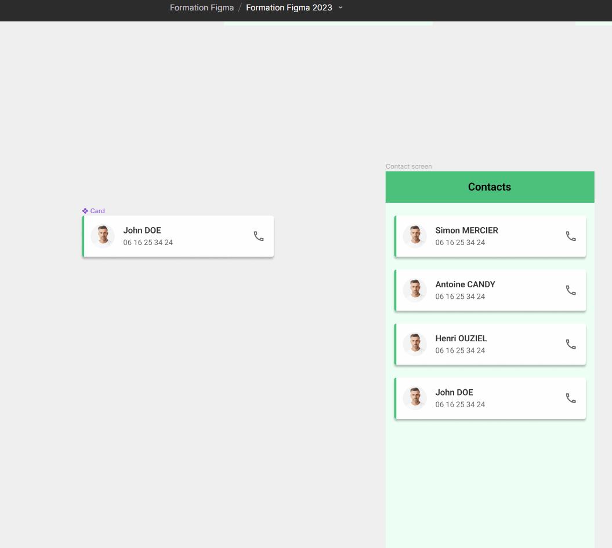
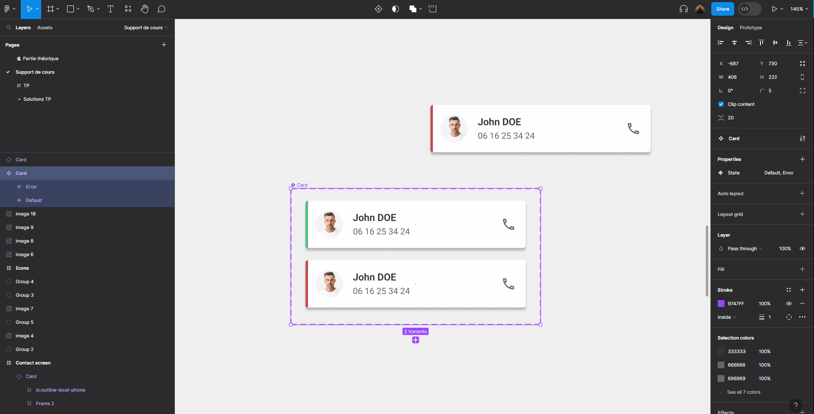
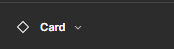
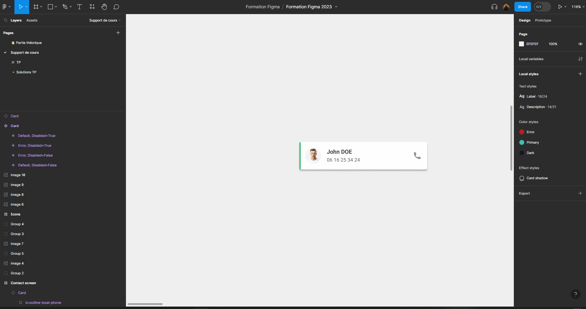
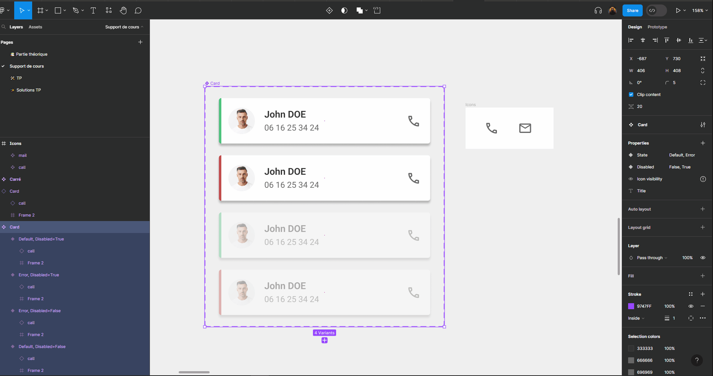

# Composants

Les Composants sont des éléments que vous pouvez réutiliser dans vos designs. Ils permettent de créer et de gérer des designs cohérents.

Un composant comporte deux aspects :

- Un **Composant Principal** définit les propriétés du Composant.
- Une **Instance** est une copie du composant que vous pouvez réutiliser dans vos designs. Les instances sont liées au Composant principal et reçoivent toutes les mises à jour apportées au Composant.

Vous pouvez créer des composants à utiliser dans un seul fichier. Vous pouvez aussi utiliser Bibliothèque d'équipe pour partager des composants et des Styles entre des fichiers et des projets.

🎯 **Objectif : Transformer notre card en composant**

## Créer un composant

Pour faire de la card un composant : 
- Sélectionnez la card
- Cliquez sur  au milieu de la barre d'outil.

Bravo, vous venez de créer votre premier composant ! Vous pouvez voir dans le panneau des calque que la card est maintenant violette avec le symbole composant.

## Créer des instances de composant

Quand vous créez une copie d'un composant, les copies sont automatiquement des instances de ce composant. Vous pouvez donc créer des instances de la card en faisant des copier-coller, ou en maintenant <kbd>alt</kbd> enfoncé et en faisant des glisser-déposer depuis le composant parent.

::: tip Astuce
Vous pouvez aussi créer des instances depuis une instance. Copier le composant parent ou une instance du composant parent a en fait le même effet.
:::

Les instances sont aussi violettes mais le symbole est différent :

::: warning Ne pas mélanger le parent
Il est fortement déconseillé d'utiliser le composant parent dans les écrans. Une bonne pratique est de garder les composants parents en dehors des écrans, idéalement tous regroupés dans une page séparée du Figma.

:::

Vous pouvez maintenant tester modifier le composant parent (texte, couleurs, positionnement, etc) et vous verrez que toutes les instances se mettent à jour automatiquement !

Essayez ensuite de modifier une instance : vous verrez que les modifications que vous effectuez dans les instances **écrasent** les valeurs du composant parent.
Par exemple, vous pouvez définir un texte différent pour chacune des instances de card. Et si vous modifiez ensuite ce même texte dans le composant parent, cela ne modifiera pas les instances !

Et cela fonctionnera de la même manière pour toutes les modifications de propriété comme les couleurs, polices, etc

::: details Tutoriel 🎥

:::

::: warning Modification de positionnement
Vous aurez peut être remarqué qu'il n'est pas possible de modifier le positionnement des éléments dans les instances. Il n'est pas non plus possible d'ajouter d'éléments.

C'est normal, c'est la manière dont fonctionnent les composants. Nous allons voir dans la suite de chapitre comment rendre nos composants plus flexibles.
:::

## Variants de composant

Créer des variants d'un composant permet de définir plusieurs variations que peut prendre un composant pour pouvoir par la suite facilement basculer entre ces variations.

Pour créer un variant de la card, sélectionner le composant parent puis cliquer sur le symbole  au milieu de la barre d'outil. Vous pouvez même créer plusieurs variants d'un même composant (voir vidéo ci-dessous).

::: details Tutoriel 🎥

:::

Pour l'exercice, nous allons créer un variant de la card en changeant la couleur du liseré de vert à rouge, pour indiquer un état d'erreur.

Une fois la couleur modifiée, nous allons affecter les noms `Default` et `Error` à nos 2 variants puis vérifier que nous pouvons facilement passer de l'un à l'autre.

::: details Tutoriel 🎥

:::

Il est possible de combiner plusieurs variants pour un même composant.

Nous allons créer 2 nouveaux variants à notre card pour les états `Disabled`. La card aura une opacité de 38% en état disabled.

::: details Tutoriel 🎥

:::

Vous aurez certainement remarqué que pour le variant `Disabled` Figma a utilisé un switch plutôt qu'une liste déroulante.

C'est parce que j'ai utilisé pour les valeurs de mes variants `True` et `False`. Cela fonctionne aussi avec `On` et `Off`.

## Instance swap

Il est possible de basculer d'une instance d'un composant à une instance d'un autre composant en faisait une `instance swap`.

Ce besoin peut paraître étrange, voyons dans un premier temps comment cela fonctionne puis nous verrons un cas d'usage concret.

Pour faire une `instance swap` il nous faut un 2ème composant. Pour tester rapidement, nous allons créer un composant de test : un simple carré.

Puis nous allons échanger l'instance de notre card pour une instance du carré via le bouton .

::: details Tutoriel 🎥

:::

Bien, maintenant à quoi cela peut-il servir ? 🤔

Une utilisation très pratique est de gérer ses icônes avec des instances swap.

Commencez par importer quelques icônes dans Figma.

::: tip 💡 Plugin d'importation d'icônes

Le plus simple pour importer des icônes dans Figma est d'utiliser un plugin. Je vous conseille soit `Material Symbols` pour avoir des icônes Material cohérentes. Soit `Iconify` pour un plus large choix d'icônes.

Vous pouvez rechercher des plugins depuis la barre d'outil :

:::

Une fois vos icônes importées, faîtes de chaque icône un composant, puis mettez les dans une même `frame` :

::: details Tutoriel 🎥

:::

Vous pouvez maintenant créer une instance d'une de vos icônes. Puis lorsque vous faîtes une `instance swap` de cette icône, vous verrez que par défaut Figma vous propose la liste des autres composants présents dans la même `frame`. C'est ainsi très pratique de changer une icône dans un design.

::: details Tutoriel 🎥

:::

## Autres propriétés

Il existe 3 autres types de propriété qui peuvent s'appliquer à un composant de manière similaire aux variants.

### Boolean

La propriété `Boolean` permet d'activer ou de désactiver la visibilité d'un élément.

Nous pouvons l'utiliser pour choisir d'afficher ou non l'icône de notre card.

Il faut dans un premier temps créer la propriété de type `Boolean` que nous pouvons appeler `Icon visibility`.

Puis il faut l'appliquer à nos 4 icônes en utiliser le bouton `Apply property`  de la section `Layer`.

::: details Tutoriel 🎥

:::

> Le fonctionnement de la propriété `Boolean` est similaire à celui d'un variant `True`/`False` mais sans avoir besoin de dupliquer le composant !

### Instance swap

La propriété `Instance swap` permet de faire remonter au niveau du composant la possibilité de faire une `instance swap` sur un composant imbriqué dans ce composant.

Très utile pour les icônes comme vu précédemment.

Commencez par créer un composant de l'icône téléphone et à l'utiliser dans le composant card.

::: tip 💡 <kbd>Ctrl</kbd> + <kbd>Shift</kbd> + <kbd>R</kbd>
Pour remplacer l'icône déjà présente dans votre card par une instance du composant vous pouvez :
- <kbd>Ctrl</kbd> + <kbd>C</kbd> sur le composant que vous venez de créer
- Sélectionner l'icône dans la card
- <kbd>Ctrl</kbd> + <kbd>Shift</kbd> + <kbd>R</kbd>
:::

Vous pouvez maintenant créer votre propriété `Instance swap` sur votre composant card, sélectionner les icônes et affecter cette propriété à ces icônes.

Vous pourrez ensuite changer simplement l'icône de votre card !

::: details Tutoriel 🎥

:::

### Text

La propriété `Text` permet de mieux faire ressortir les textes modifiables d'un composant.

Cela peut être intéressant pour que l'on comprenne rapidement quels textes sont modifiables dans le composant. 

La valeur ajoutée est tout de même moins importante par rapport à une `Instance swap` puisqu'il est facile de modifier un texte en cliquant directement dessus, même si il n'a pas de propriété de définie.

::: details Tutoriel 🎥

:::

### Nested intances

Enfin, lorsque l'on a des composants imbriqués, il est possible de faire remonter les propriétés au composant qui les contient.

Nous n'avons pas de cas d'usage avec notre card donc je vous propose exceptionnellement de ne pas créer d'exemple, vous aurez l'occasion de vous exercer dans la partie pratique.

Voici un exemple de cas d'utilisation. Nous avons ici un composant barre de navigation qui est lui même composé de 5 composants pour les onglets.

Grâce aux `nested instances`, il est possible d'accéder aux propriétés de tous les composants imbriqués (les 5 onglets) simplement en sélectionnant le composant global (la barre de navigation).

