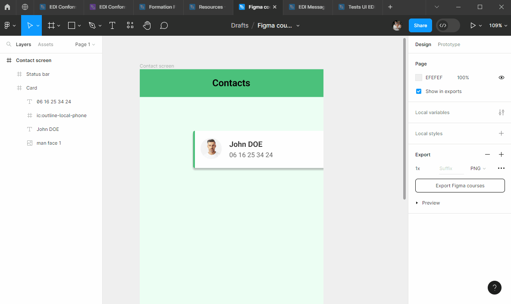

# Positionnements

::: tip 🎯 Objectif : Positionner correctement les éléments entre eux au pixel prêt !

:::

## Alignements

### Alignement d'un élément dans un conteneur

Comme nous l'avons déjà vu, Figma permet d'aligner (à gauche, à droite, en haut, en bas, au centre) un élement à l'interieur de son conteneur (`Frame`, `Groupe`, `Section`) :
- directement dans le plan de travail (aides visuelles de Figma)
- à l'aide des boutons d'alignements en haut à droite du `Design panel`

::: details Tutoriel 🎥

:::

### Alignement de plusieurs élements

::: tip Sélection en profondeur 💡

Pour sélectionner un élément à l'interieur d'un autre (groupe, frame) : 
- soit double-cliquer jusqu'à atteindre l'élement
- soit maintenir la touche <kbd>Ctrl</kbd> enfoncée puis cliquer sur l'élément

:::

## Espacements

(work in progress)

## Grilles