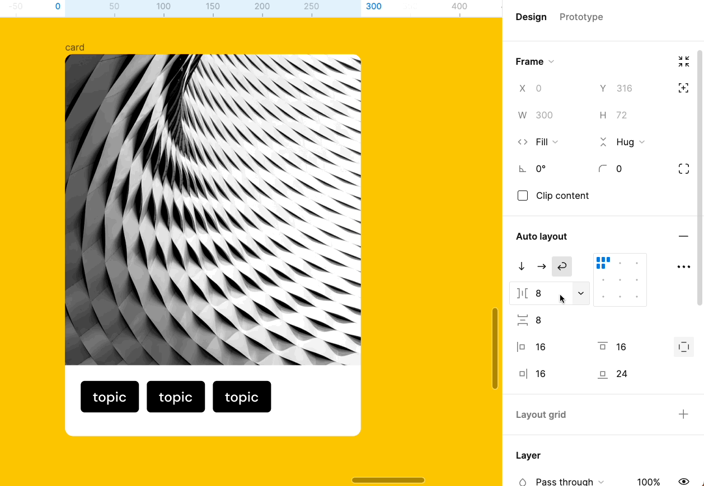
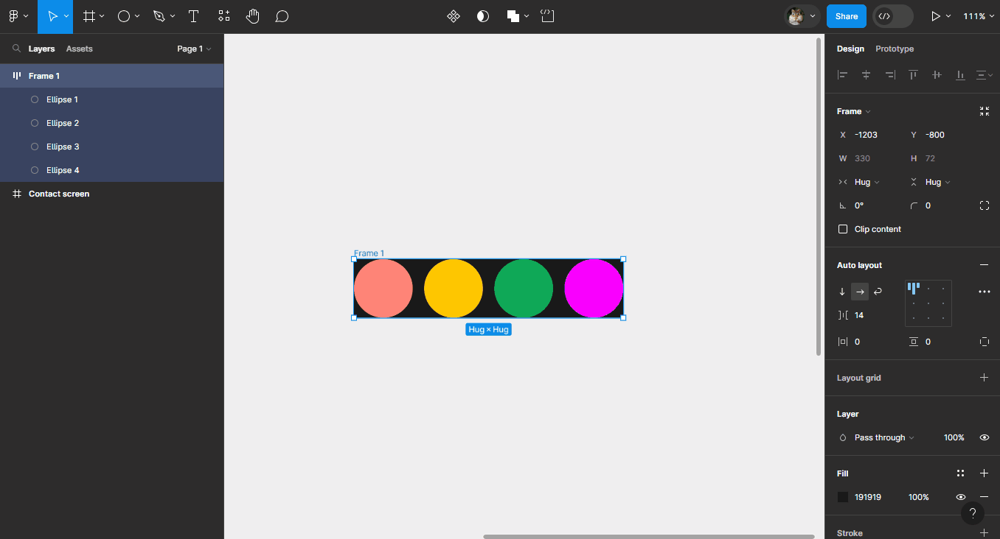
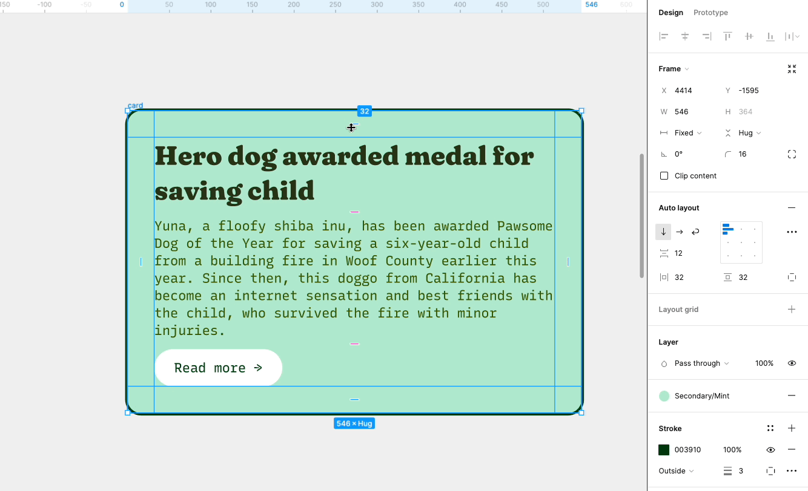
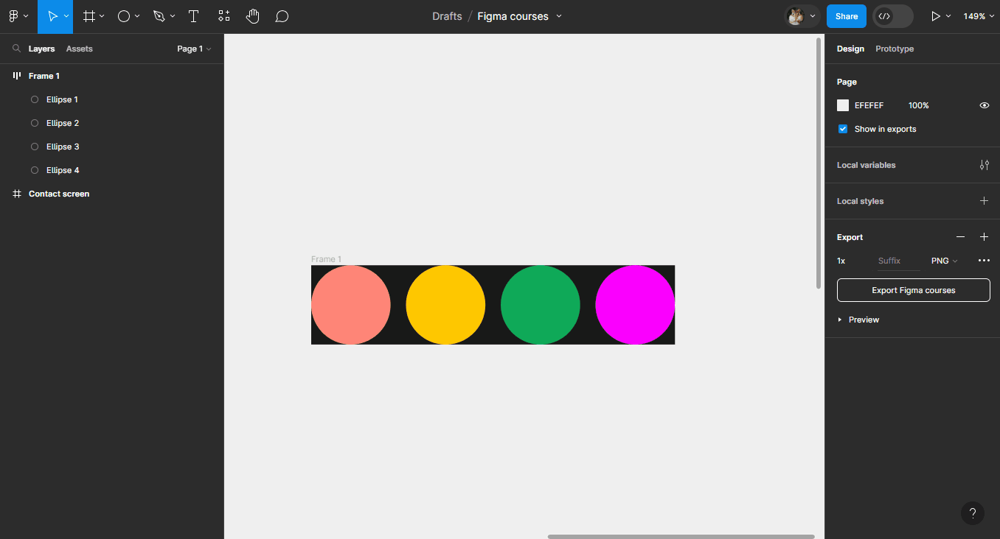

# Espacements

## Ecart entre les éléments

Utilisez l'écart  (`Gap between items`) pour gérer la distance entre les éléments dans un `Autolayout`.

Le `Gap` possède deux modes : 
- **L'écart spécifique** : spécifiez la distance en entrant une valeur dans le champ. Vous pouvez aussi augmenter/diminuer la valeur du champ au clavier avec les flèches directionnelles ou en cliquant-glissant votre curseur sur .
- **L'écart automatique** : saisir la valeur "**Auto**", ou la sélectionner dans le menu déroulant, pour que les éléments soient le plus écartés possible.

> **Remarque :** Vous pouvez paramétrer le `Gap` entre les éléments si la direction est `Horizontal`  ou `Vertical` . Si la direction est en mode `Wrap`, il est possible de gérer le `Gap` horizontal et vertical à la fois.

::: details Démo 🎥

:::

**Exercice :** Essayez de mettre le `Gap` en automatique sur votre `Autolayout` puis d'agrandir votre `Frame` !

::: details Tuto 🎥

:::

## Padding

Le padding dans un `Autolayout` contrôle l'espace vide entre le contenu de la `Frame` (ses éléments) et son contour. Vous pouvez définir un padding de manière uniforme, verticale, horizontale ou bien mettre une valeur différente en haut, en bas, à gauche et à droite.

::: details Démo 🎥

:::

Vous pouvez ajuster le padding dans le `Design panel` à droite : par défaut les options de padding sont séparées entre vertical (haut et bas) et horizontal (droite et gauche). 

> **Remarque :** Pour définir un padding sur chaque côté individuellement :
- cliquez sur  
- 4 champs `top`, `right`, `bottom` et `left` apparaissent !
- Utilisez ces champs pour modifier les paddings
- Maintenez la touche <kbd>Ctrl</kbd> enfoncée et cliquez sur l'un des champs, vous pouvez maintenant saisir les paddings haut, droite, bas, gauche sous le format `1,2,3,4`

::: details Démo 🎥

:::

**Exercice :** Modifiez les paddings ! Essayez les différentes techniques pour modifiez le padding de votre `Autolayout`

::: details Tuto 🎥

:::

