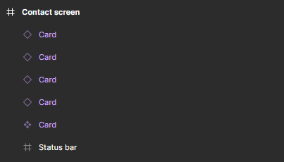
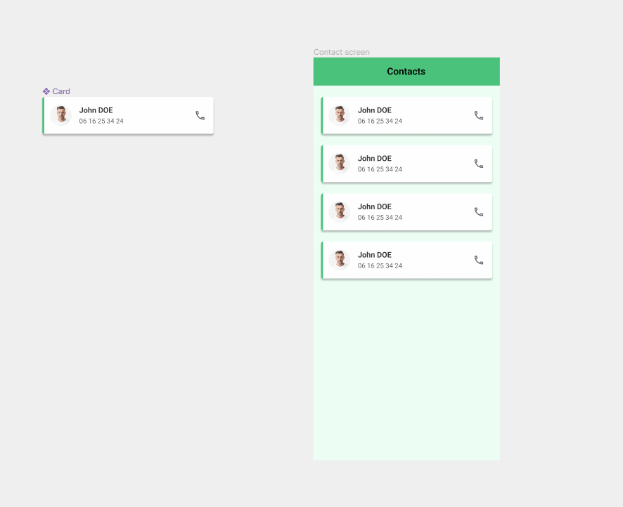
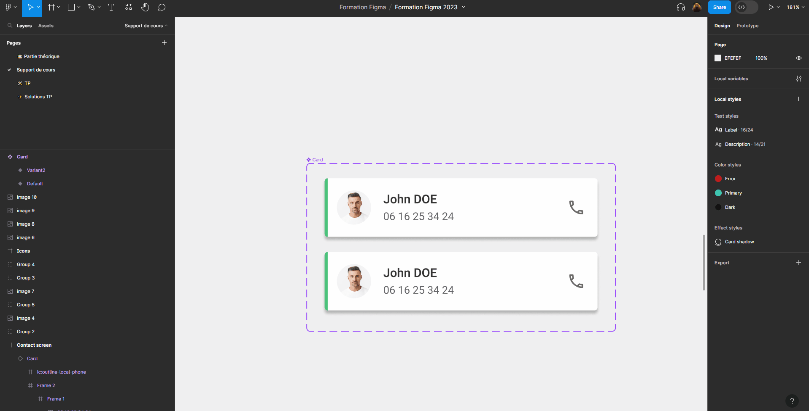
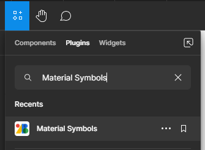
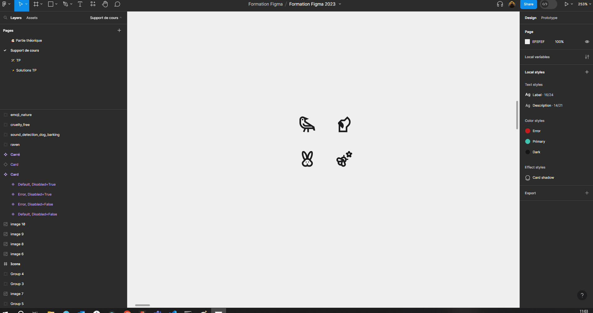
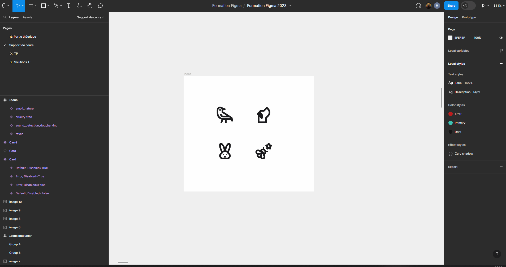
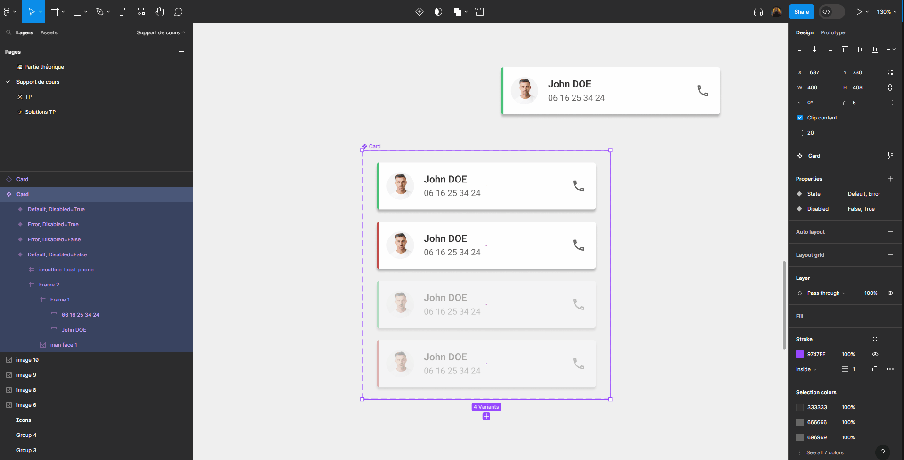
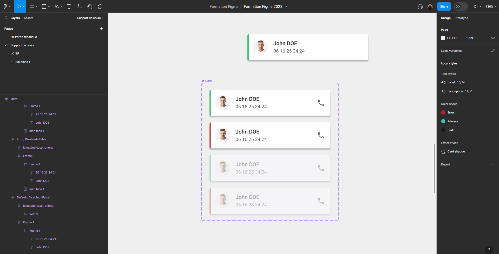
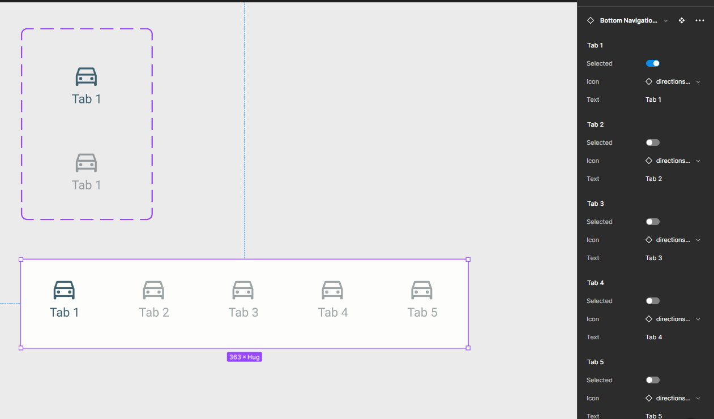

# Composants

Les Composants sont des éléments que vous pouvez réutiliser dans vos designs. Ils permettent de créer et de gérer des designs cohérents.

Un composant comporte deux aspects :

- Un **Composant Parent** définit les propriétés du Composant.
- Une **Instance** est une copie du composant que vous pouvez réutiliser dans vos designs. Les instances sont liées au Composant parent et reçoivent toutes les mises à jour apportées à celui-ci.

🎯 **Objectif : Transformer notre card en composant**

## Créer un composant

Pour faire de la card un composant : 
- Sélectionnez la card
- Cliquez sur  au milieu de la barre d'outil.

Bravo, vous venez de créer votre premier composant ! Vous pouvez voir dans le panneau des calque que la card est maintenant violette avec le symbole composant.

## Créer des instances de composant

Quand vous créez une copie d'un composant, les copies sont automatiquement des instances de ce composant. Vous pouvez donc créer des instances de la card en faisant des copier-coller, ou en maintenant <kbd>alt</kbd> enfoncé et faisant glisser votre

::: tip Astuce
Si vous dupliquez une instance, elle sera elle aussi liée au composant parent.
:::

Les instances sont aussi violettes mais le symbole est différent :

::: warning Ne pas mélanger le parent
Il est fortement déconseillé d'utiliser le composant parent dans les écrans. Une bonne pratique est de mettre les composants parent dans une page différente du Figma.

:::

**A faire:**
- Modifiez le composant parent (texte, couleurs, positionnement, etc) et remarquez que les instances se mettent à jour automatiquement !
- Modifiez les prénom/nom pour chacune des intances de cards.
> **Remarque :** si vous modifiez ce même texte dans le composant parent, cela ne modifiera pas les instances ! Et cela fonctionnera de la même manière pour toutes les modifications de propriété comme les couleurs, polices, etc

::: details Tutoriel 🎥

:::

::: tip Réinitialiser une instance
- Faîtes `Clique droit` sur une instance et `Reset all changes` pour réinitialier une instance par rapport à son composant parent.
- Faîtes `Clique droit` sur une instance et `Detach instance` pour supprimer son lien avec le composant parent
:::

::: warning Modification de positionnement
Vous aurez peut être remarqué qu'il n'est pas possible de modifier le positionnement des éléments dans les instances. Il n'est pas non plus possible d'ajouter d'éléments.

C'est normal, c'est la manière dont fonctionnent les composants. Nous allons voir dans la suite de ce chapitre comment rendre nos composants plus flexibles.
:::

## Variants de composant

Créer des variants d'un composant permet de le décliner en différents états.

### Création d'un variant de composant
**A faire:** sélectionnez le composant parent puis cliquez sur le symbole  au milieu de la barre d'outil. 

> Vous pouvez même créer plusieurs variants d'un même composant.

::: details Tutoriel 🎥

:::

### Paramétrages du variant
Nous allons créer un état d'erreur à la card, en changeant la couleur de son liseré de vert à rouge.

**A faire:**
- Changez la couleur du liseré du variant de vert à rouge.
- Donnez le nom `State` à la propriété de type variant
- Affectez les noms `Default` et `Error` à nos 2 états

::: details Tutoriel 🎥

:::

### Combiner les variants
Il est possible de combiner plusieurs variants pour un même composant.

Nous allons créer 2 nouveaux variants à notre card pour les états `Disabled`. La card aura une opacité de 38% en état disabled, qui est l'opacité utilisée par Google pour Material Design.

**A faire:**
- Créez une nouvelle propriété de type variant et nommez la `Disabled` avec `False` pour valeur par défaut.
- Dupliquez les cartes existantes pour créer 2 nouveaux états.
- Affectez une opacité de 38% à ces 2 nouveaux états.
- Modifiez la valeur de la propriété `Disabled` sur ces 2 nouveaux états à `True`.

::: details Tutoriel 🎥

:::

::: tip Astuce
Vous aurez certainement remarqué que pour le variant `Disabled` Figma a utilisé un switch plutôt qu'une liste déroulante.

C'est parce que nous avons utilisé pour les valeurs des variants `True` et `False`. Cela fonctionne aussi avec `On` et `Off`.
:::

## Instance swap

Il est possible de basculer d'une instance d'un composant à une instance d'un autre composant en faisait une `instance swap`.

Ce besoin peut paraître étrange, voyons dans un premier temps comment cela fonctionne puis nous verrons un cas d'usage concret.

### Exercice

Pour faire une `instance swap` il nous faut un 2ème composant. Pour tester rapidement, nous allons créer un composant de test : un simple carré.

**A faire:**
- Créez un carré.
- Faîtes de ce carré un composant.
- Créez une instance du composant card.
- Faîtes une `instance swap` sur cette instance pour le transformer en carré via le bouton .

::: details Tutoriel 🎥

:::

### Cas concret: les icônes

Bien, maintenant à quoi cela peut-il servir ? 🤔

Une utilisation très pratique est de gérer ses icônes avec des instances swap.

**A faire:**
- Importez quelques icônes dans Figma.
::: tip 💡 Plugin d'importation d'icônes

Le plus simple pour importer des icônes dans Figma est d'utiliser un plugin. Je vous conseille soit `Material Symbols` pour avoir des icônes Material cohérentes. Soit `Iconify` pour un plus large choix d'icônes.

Vous pouvez rechercher des plugins depuis la barre d'outil :

[Plus d'informations sur les plugins ici](../plugin.md)
:::
- Faîtes de chaque icône un composant.
- Créez une frame vide, nommez-la `icons`.
- Placez-y vos icônes.

::: details Tutoriel 🎥

:::

Testons maintenant que cela fonctionne bien.

**A faire:**
- Créez une instance d'une de vos icônes.
- Faîtes une `instance swap` dessus: par défaut Figma vous propose la liste des autres composants présents dans la même `frame`, soit les autres icônes.

C'est ainsi très pratique de changer une icône dans un design !

::: details Tutoriel 🎥

:::

## Autres propriétés

Il existe 3 autres types de propriété qui peuvent s'appliquer à un composant de manière similaire aux variants.

### Boolean

La propriété `Boolean` permet d'activer ou de désactiver la visibilité d'un élément.

Nous pouvons l'utiliser pour choisir d'afficher ou non l'icône de notre card.

**A faire:**
- Créer une propriété de type `Boolean` et appelez-la `Icon visibility`.
- Sélectionnez une des icônes et appuyez sur `Apply property`  de la section `Layer`.

> Vous pouvez sélectionner toutes les icônes d'un coup en maintenant <kbd>Ctrl</kbd> + <kbd>Shift</kbd>.

::: details Tutoriel 🎥

:::

> Le fonctionnement de la propriété `Boolean` est similaire à celui d'un variant `True`/`False` mais sans avoir besoin de dupliquer le composant !

### Instance swap

La propriété `Instance swap` permet de faire remonter au niveau du composant la possibilité de faire une `instance swap` sur un composant imbriqué dans ce composant.

Très utile pour les icônes comme vu précédemment.

**A faire:**
- Creéz un composant pour l'icône présente dans votre card.
- Utilisez des instances de ce composant icône dans chacune des variants de votre card.
::: tip 💡 <kbd>Ctrl</kbd> + <kbd>Shift</kbd> + <kbd>R</kbd>
Pour remplacer l'icône déjà présente dans votre card par une instance du composant vous pouvez :
- <kbd>Ctrl</kbd> + <kbd>C</kbd> sur le composant que vous venez de créer
- Sélectionner l'icône dans la card
- <kbd>Ctrl</kbd> + <kbd>Shift</kbd> + <kbd>R</kbd>
:::
- Ajoutez une propriété `Instance swap` sur le composant card.
- Sélectionnez les icônes et affectez-leur cette nouvelle propriété.

Vous pourrez ensuite changer simplement l'icône de votre card !

::: details Tutoriel 🎥

:::

### Text

La propriété `Text` permet de mieux faire ressortir les textes modifiables d'un composant.

Cela peut être intéressant pour que l'on comprenne rapidement quels textes sont modifiables dans le composant. 

La valeur ajoutée est tout de même moins importante par rapport à une `Instance swap` puisqu'il est facile de modifier un texte en cliquant directement dessus, même si il n'a pas de propriété de définie.

**A faire:**
- Créez une propriété de composant de type text
- Nommez-la `Title` avec la valeur par défaut de votre choix
- Sélectionnez les titres de tous les variants de votre card et affectez-leur cette nouvelle propriété

::: details Tutoriel 🎥

:::

### Nested intances

Enfin, lorsque l'on a des composants imbriqués, il est possible de faire remonter les propriétés des composants imbriqués au composant qui les contient.

Nous n'avons pas de cas d'usage avec notre card donc je vous propose exceptionnellement de ne pas créer d'exemple pour ne pas compliquer inutilement les choses, vous aurez l'occasion de vous excercer dans la partie pratique.

Ci-dessous un exemple de cas d'utilisation. Nous avons ici un composant barre de navigation qui est lui même composé de 5 composants pour les onglets.

Grâce aux `nested instances`, il est possible d'accéder aux propriétés de tous les composants imbriqués (les 5 onglets) simplement en sélectionnant le composant global (la barre de navigation).

