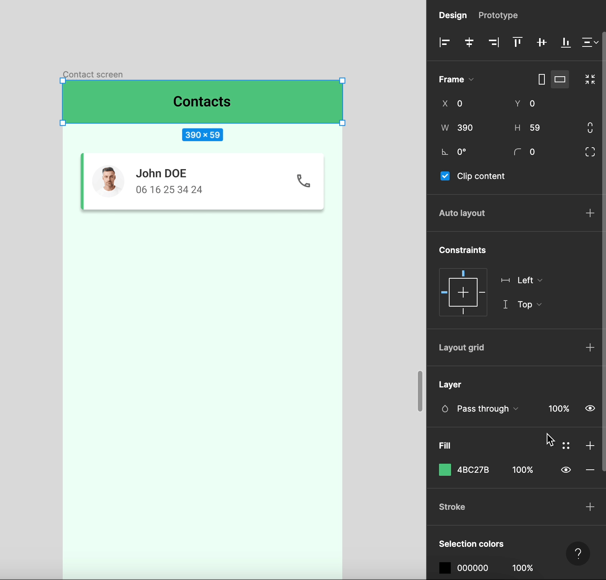

# Styles & variables

## Définition

Les styles permettent de définir la couleur, le texte et les effets appliqués aux objets, ou de définir la structure et l'apparence des grilles de mise en page.

Il existe 4 types de styles : **Couleurs, textes, effets et grilles**

Ces styles sont applicables à vos éléments et permettent d'avoir un design cohérent utilisant les styles à la manière d'une charte graphique.

🎯 **Objectif : Créer et appliquer les différents styles à nos éléments**

## Créer un style 

Nous allons créer le style `Primary` qui correspond à la couleur principale de notre maquette :
- Cliquez sur l'icône  de la section `local styles`
- Sélectionnez le style `color`
- Indiquez les caractéristique du style
- Validez

Félicitations, vous avez créé votre premier style !

Ce procédé est identique pour créer des styles de textes, effets et grilles.

::: details Tutoriel 🎥

:::

::: tip Astuces
Les styles créés sont automatiquement affichés dans le `panneau de conception` lorsqu'aucun élément n'est sélectionné.
:::

### Appliquer les styles

Le style "Primary" étant créé, il faut désormais l'appliquer à notre maquette.

Sélectionnez le bandeau vert, sa couleur est la même que celle du style créé mais est référencée par son code #HEX dans la section `fill`.
En cliquant sur  vous accédez à la bibliothèques de styles de couleurs, puis sélectionnez le style "Primary" précèdement créé pour l'appliquer.

::: details Tutoriel 🎥

:::

::: tip Astuce
Sélectionner un objet (groupe, frame, etc) permet d'accéder au menu `selection colors` en bas du menu de conception, répertoriant toutes les couleurs utilisées de la sélection.

De cette manière vous pouvez aisément modifier ou remplacer les couleurs, manuellement ou en sélectionnant des styles via 

::: details Tutoriel 🎥

:::

## Créer les styles depuis vos éléments

Nous allons désormais créer des styles depuis les éléments de notre maquette. Durant sa conception nous avons choisi des couleurs, typographies et effets mais ceux-cis n'ont pas encore été créé en tant que styles.

Sélectionnez la card afin de créer le style de couleur de son fond actuellement blanc : `#FFFFFF`.
Dans la section `fill`, en cliquant sur  puis  on accède à la création de style de couleur.

On peut alors nommer et donner une description à la couleur existante.

::: details Tutoriel 🎥

:::

Vous êtes désormais capables de créer les styles des couleurs restantes, mais aussi de faire de même pour les **typographies, effets et grilles**

## Modifier les styles

Vous pouvez éditer à tout moment vos styles depuis le panneau de conception. Les modifications s'appliquent à tous les éléments auxquels vous avez appliqué vos styles.

Lorsque vous sélectionnez un objet avec un style, vous avez la possibilité de `détacher` un style via l'icône 
.

Les modifications de style ne s'appliqueront plus à cet élément même si les caractéristiques sont les mêmes, voir exemple ci-dessous.

## Local styles et libraries

Les styles que vous créez dans un fichier sont automatiquement enregistré sur ce fichier Figma et sont accessibles par tous les membres ayant des droits d'édition.

Vous pouvez également `publier` vos styles pour les partager avec les membres de la `Team library`.
De cette manière vous et les membres de l'équipe pourrez réutiliser ces styles à travers plusieurs fichiers Figma, ce qui est particulièrement utile lors de la création d'un système si ce dernier comporte beaucoup d'éléments.

Pour publier une librairie de styles, cliquez sur 
 puis sélectionnez `libraries` et publiez la bibliothèque choisie.

## Ouverture sur les variables

La fonctionnalité `Local variables` est une feature de Figma encore en beta permettant de définir des caractéristiques qui peuvent ensuite être appliquées à vos éléments, ce sont des `variables`.

::: warning Attention
La fonctionnalité des `variables` n'est accessible que depuis une versio payante de Figma.
:::

En apparence, les variables et styles sont similaires :
- Ils peuvent être publiés dans les bibliothèques de l'équipe et réutilisés dans toutes les conceptions.
- Ils permettent une gestion efficace des `design systems`, car les mises à jour d'une variable ou d'un style entraîneront des mises à jour pour tous les design systems qui les utilisent.

Pourtant les variables permettent davantage de complexité : les variables peuvent être utilisées pour définir d'autres variables et styles, mais les styles ne peuvent définir ni les unes ni les autres.

Les variables permettent de créer des **valeurs de texte, de nombre, de couleur et de booléennes.**
Vous pouvez définir et modifier ces valeurs depuis un espace de collection de variables qui vous permettront par exemple de pouvoir ajuster facilement le thème (dark mode ou light mode), du texte, ou encore de gérer vos espacements et vos corner radius.

Les variables permettent également de faire du prototypage avancé de vos maquettes.
Pour une meilleure compréhension de cette feature, nous vous invitons à consulter cette
[vidéo de présentation des variables](https://www.youtube.com/watch?v=1ONxxlJnvdM&t=344s&ab_channel=Figma/)