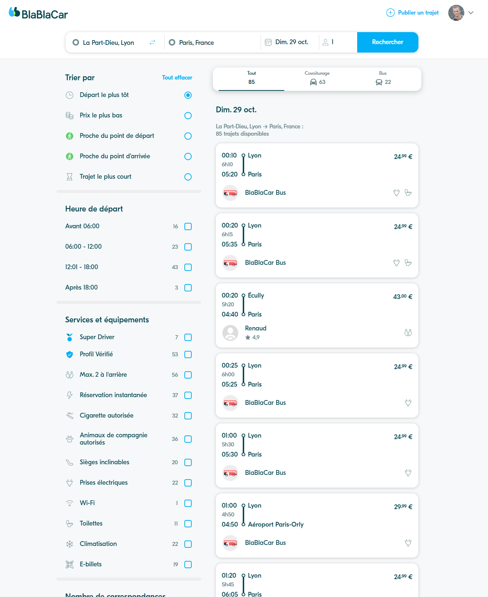

# Reproduire un design existant

::: tip 🎯 Objectif : Construire cette vue sur Figma !

:::

A présent que nous avons expérimenté les différents outils de Figma sur un exemple simple, nous allons essayer de créer une vue complète à partir d'un exemple réel.

L'objectif est de moins vous guider que dans la partie théorique mais nous vous proposons tout de même de découper la tâche globale en plus petites tâches sinon cela peut être compliqué de savoir par où commencer !

Pas de panique si vous n'avez pas le temps de terminer l'écran, c'est un objectif certainement trop ambitieux pour le temps prévu pour cette formation.

Avoir plus de matière permet aux plus rapides d'aller plus loin et également de continuer à vous exercer en dehors du cadre de cette formation si vous le souhaitez.

Si vous continuez l'exercice plus tard, vous pourrez toujours nous contacter pour une review de votre Figma :)

::: warning 

En recopiant un design depuis une capture d'écran, le résultat ne peut évidemment pas être parfaitement identique.

Vous pouvez par exemple utiliser des polices et icônes différentes, ce n'est pas cela qui est important.

:::

::: tip Correction

[Un exemple de solution est disponible ici](https://www.figma.com/file/uUvHGlJITQbQQnn4zMxJku/Blablacar?type=design&node-id=0%3A1&mode=design&t=ebOpGpn3qxmYY7BI-1).

Essayez d'abord par vous même avant de regarder la correction !

( Il y a plusieurs pages au Figma ;) )

:::