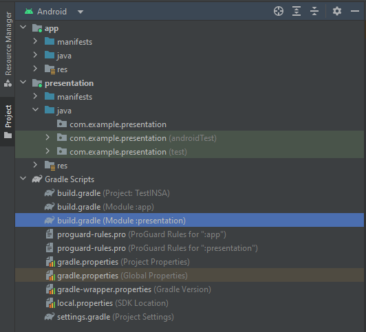

# Modules

As we saw in the `App Architecture` lesson, this is the architecture we are aiming for:


Currently, you should have all your code in the base `App` module.

You can start by creating all the modules (empty for the moment) you need.

To create a module, go in `File -> New -> New module`. Choose the template `Phone & Tablet`, enter the module's name then choose `No Activity`.

Wait a moment then you should see your new module in the tree structure on the left.

Note that a `build.gradle.kts` file has been created with your module.

<figure align="center">

<figcaption align="center">In your app, you should see build.gradle.kts files</figcaption>
</figure>

It's in these `build.gradle.kts` files for the different modules that you will define which module sees which module.

For example, in the `build.gradle.kts` file of the module `data`, you need to add these 2 lines in the `dependencies` bloc so that `data` can have access to `domain` and `common`.

``` kotlin
implementation(project(":domain"))
implementation(project(":common"))
```

Do this for all the dependencies according to the clean architecture schema above.

::: warning App module exception
We will use a small modification of the clean architecture.

You can make the app module see all the others modules.
:::

Finally, you can move your current code into the appropriates modules: 
- Move the files with your fake data to the `domain` module (they will be deleted later in this chapter).
- Move all your other files to the `presentation` module.
