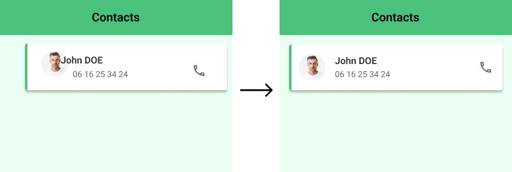

# Positionnements

::: tip 🎯 Objectif : Positionner correctement les éléments entre eux

:::

## Alignements

### Aides d'alignement

(work in progress)

::: tip Sélection en profondeur 💡

Pour sélectionner un élément à l'interieur d'un autre (groupe, frame) : 
- soit double-cliquer jusqu'à atteindre l'élement
- soit maintenir la touche <kbd>Ctrl</kbd> enfoncée puis cliquer sur l'élément

:::

### Espacements

(work in progress)

## Grilles