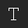
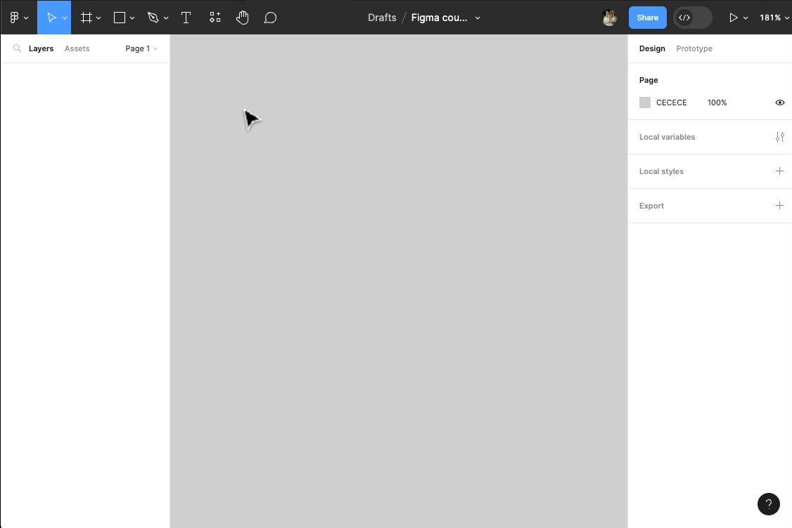
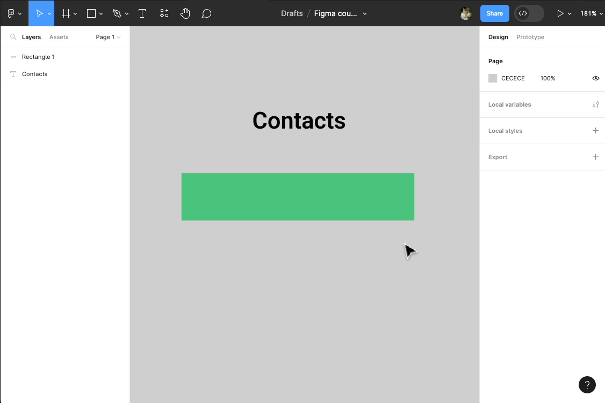
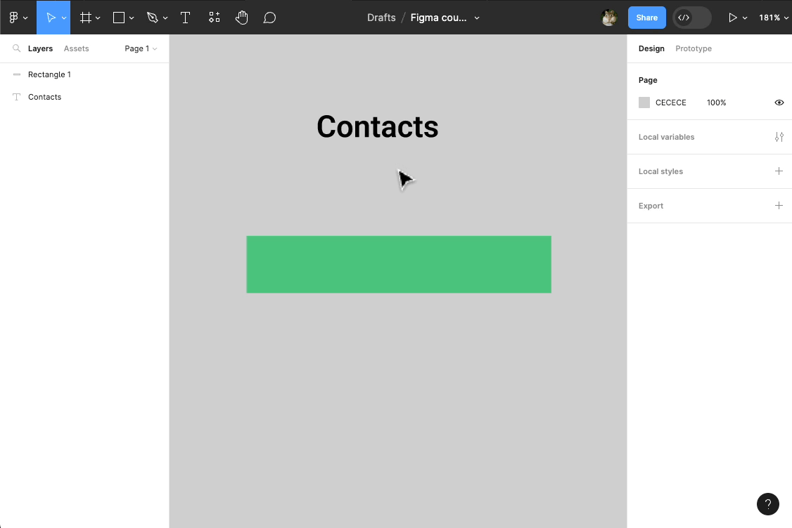
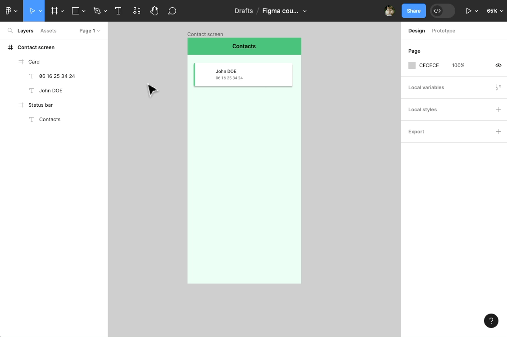

# Éléments d'interface

## Textes

Pour créer des éléments d'interface (qui vont former notre design), nous allons utiliser les outils de création de la **toolbar**.

Par exemple pour créer un texte, sélectionnez l'outil de texte  et cliquez dans le plan de travail. Vous pouvez saisir le texte que vous souhaitez.

Cliquez en dehors de l'élément de texte puis re-sélectionnez le pour pouvoir modifier ses propriétés dans le **design panel** à droite.

> **Remarque :** Dans l'exemple ci-dessus nous modifions l'épaisseur (Semi-bold), la taille (24px), et la police du texte (Roboto).

## Formes

Toujours dans la toolbar, choisissez l'outil de forme **Rectangle**, et tracez un rectangle dans le **plan de travail** à côté de votre texte.

Une fois créé et sélectionné, vous pouvez modifier ses propriétés (ex: changer sa couleur).

> **Remarque :** Il est possible de modifier certaines propriétés de votre rectangle directement dans le plan de travail (dimensions, rotations).

## Groupes

Afin de créer des éléments d'interface plus complexe il est possible de grouper des élements. 

Pour l'exemple nous allons créer une barre de statut (que l'on peut retrouver sur beaucoup d'appli mobiles).

Pour celà, commencez par positionner le texte au milieu du rectangle.

::: tip Superposition des calques
> **Attention :** Comme le rectangle a été créé en dernier, il apparait au dessus du texte dans le **panneau des calques** à gauche. Il faut donc changer l'ordre de superposition des calques.

Plusieurs façons de faire :
- Clique droit sur le texte, puis sélectionnez l'option _Bring to front_
- Clique droit le rectangle et, clique droit puis sélectionnez l'option _Send to back_

- Dans le **panneau des calques** à gauche, faites glisser le texte au dessus du rectangle ou bien l'inverse.

:::

::: tip Positionnement
Pour centrer des éléments les uns par rapport aux autres, il existe plusieurs solutions :
- Sélectionnez tous les éléments (avec <kbd>Shift</kbd> OU en trançant un rectangle autour avec l'outil de sélection ) puis utilisez les boutons d'alignement dans le **design panel** à gauche en haut 

- Sélectionnez directement le texte au centre du rectangle avec les aides visuels de Figma

:::

Une fois positionnés, sélectionnez le texte et le rectangle (par exemple avec <kbd>Shift</kbd>) puis faites <kbd>Ctrl</kbd> + <kbd>G</kbd> pour grouper.

> **Remarque :** Vous pouvez voir qu'un nouvel élément (calque de type groupe) est apparu dans le **layers panel** à gauche. Il contient le texte et le rectangle.

Veuillez renommer les calques pour une meilleure organisation de votre design.

Vous disposez maintenant d'un élément **Status bar**** (bare de statut) utilisable dans vos futurs écrans ! 👏

## Frame / Ecrans

Pour créer des écrans dans Figma, on utilise ce qu'on appelle des **Frames**. Ce sont des conteneurs dans lesquels on va placer nos éléments d'interface.

Vous pouvez créer une frame en cliquant sur l'outil **Frame** dans la toolbar.

Dans le design panel, sélectionner un écran de téléphone (ex: iPhone 14)

> **Remarque :** Un écran de téléphone est une frame avec la résolution du modèle (hauteur et largeur en pixels) : 

::: tip Se déplacer dans le plan de travail

Le plan de travail se remplit de plus en plus ? Don't panic !!!

Vous pouvez vous déplacer grâce à l'outil **Hand tool**  ou en maintenant <kbd>Space</kbd> (barre d'espace du clavier)

Utilisez le zoom pour prendre du recul et mieux voir votre travail :
- <kbd>Ctrl</kbd> + Roulette (souris)
- Pavé tactile (ordinateur portable)
:::

On peut maintenant placer notre **Status bar** à l'intérieur de notre frame en la glissant par dessus.

Une fois à l'intérieure, vous pouvez redimensionnez et positionner la **Status bar** en haut de l'écran.

> **Aide :** Vous pouvez utiliser les aides aux positionnements de Figma pour aligner la _Status bar_ en haut à gauche de l'écran, puis redimenssioner directement dans le plan de travail la largeur de celle ci.

Ici on observe un comportement qui ne nous arrange pas : on aimerait que le texte reste centré par rapport au rectangle. Or ici, on remarque que le conteneur du texte s'est agrandit proportionnellement avec le rectangle.

::: tip Groupe VS Frames
Les **Groupes** ne sont pas flexibles (ils possèdent très peu de propriétés), les éléments à l'intérieur sont dépendants du redimensionnement. A l'inverse les **Frames** (sorte de groupes évolués) fournissent plus de contrôle : elles proposent par exemple plusieurs type de contraintes pour les éléments qu'elles contiennent.

Utilisez un(e) :
- **Groupe** - pour un design à court terme (tests utilisateurs, wireframes) qui n'a pas besoin d'une structure flexible (redimensionnements)

- **Frame** - pour un design à long terme (maintenance, évolutions) pour plus de flexibilité (éléments responsives)
:::

Pour mieux saisir la différence entre **Groupes** et **Frames** veuillez recréer une **Status bar** à l'aide d'une frame :

> **Remarque :** Avec une frame, plus besoin d'un rectangle pour mettre un fond de couleur à notre **Status bar**. Il suffit juste de changer la couleur de remplissage de la frame.

Quand on sélectionne un élement dans une frame, on remarque qu'une nouvelle propriété **Constraints** apparait dans le **design panel** à droite.

Ce sont les contraintes de l'élément par rapport à son conteneur (la frame). 

Dans une **Frame**, par défaut, les éléments (exemple : notre texte) ont une contrainte _en haut_ et _à gauche_ : c'est à dire que si on redimensionne notre frame, les élements intérieurs auront toujours une distance fixe par rapport aux bordures _haute_ et _gauche_ de la frame.

Veuillez :
- Recentrer le texte à l'intérieur de la frame.
- Appliquer lui une contrainte centrée en largeur et en hauteur
- Essayer de redimensionnez la frame 🙂

Les **Frames** nous simplifie la vie, notemment lorsque l'on veut designer des écrans responsive (contenu qui s'adapte aux différentes taille d'écran).

Crééons ensemble un écran responsive à partir des éléments dèja présent : 
- Séléctionnez l'ancienne **Status bar** (groupe texte + rectangle) puis supprimez la en pressant la touche <kbd>Back</kbd> du clavier
- Remplacez la par la nouvelle **Status bar** (frame), en la positionnant à l'intérieure de l'écran (frame **Contact screen**)
- Essayez de redimensionner l'écran de téléphone 

On souhaiterai cette fois ci que la nouvelle **Status bar** s'adapte en largeur lorsqu'on redimensionne l'écran : c'est possible, car on a utilisé des frames pour construire nos éléments !!!

Pour celà :
- Faites <kbd>Ctrl</kbd> + <kbd>Z</kbd> pour annuler le redimensionnement de l'écran
- Sélectionnez la **Status bar** puis appliquez lui une contrainte d'échelle (**Scale**) en largeur
- Essayez de redimensionner l'écran 😉

> **Remarque :** Il est donc possible de créer des Frames, dans des Frames, dans des Frames ... 👍

Et pour finir, pensez à bien renommer la Frame (**Status bar**):

## Autres propriétés

Ensemble, nous allons maintenant créer une liste de contacts. 

Pour se faire il faut maintenant créer l'élement d'interface **Contact** : 

    

**Exercice** :

- Changez la couleur de fond de l'écran **Contacts screen** (ex: vert clair - #ECFFF4)
- Crééez une frame blanche à l'intérieure de l'écran (renommez la en "Card")

- Appliquez à cette **Card** une ombre portée (Panneau de droite > Effects  > Bouton Ajouter  > **Drop Shadow**)

> **Remarque :** Vous pouvez changer les propriétés de cette ombre en cliquant sur 

- Ajoutez une bordure (**Stroke**) à cette card
- Modifiez les propriétés de la bordure :
    - elle ne doit apparaître qu'à gauche de la frame (utilisez )
    - elle doit être de couleur verte (utilisez )
    - elle doit faire 4px d'épaisseur (utilisez )

- Changez les arrondies des angles (**Corner radius**) de la **Card** (ex: 4px)

- Ajouter 2 textes dans la **Card** :
    - un pour le prénom et le nom
    - un autre pour le numéro de téléphone
- Changer les propriétés des textes comme suit :
    - Prénom/nom - **16px** de taille de texte, **24px** de hauteur de ligne (**line-height**), police **Roboto**, épaisseur **semi-bold**, couleur noire foncée **#333333**
    - Numéro - taille de texte **14px**, **21px** de hauteur de ligne, police **Roboto**, épaisseur **regular**, couleur grise **#999999**
- Aligner les textes sur la gauche, et positionner l'un en dessous de l'autre

## Images

Il est possible d'ajouter des images dans votre design Figma de plusieurs manières :
- Drag & drop (déposer glisser)

- Importer (en sélectionnant l'outil de forme **Place Image/Video**)

- Copier/Coller (<kbd>Ctrl</kbd> + <kbd>C</kbd>, <kbd>Ctrl</kbd> + <kbd>V</kbd>) dans le plan de travail

Vous pouvez maintenant : 
- Redimensionner l'image pour qu'elle face la même largeur que la hauteur (image carrée)
- Arrondir les angles au maximum pour faire cercle (avatar)
- Réduire la taille de l'image et la placer dans la **Card**

## Vectors / Icons / Plugins

