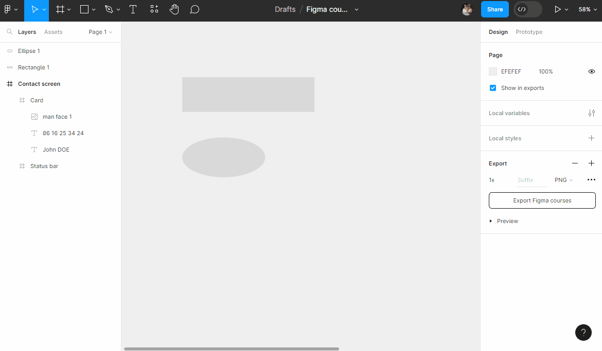

# Formes

## Rectangle
Dans la `Toolbar`, choisissez l'outil de forme `Rectangle`, et tracez un rectangle dans le `Plan de travail` à côté de votre texte.

Une fois créé et sélectionné, vous pouvez modifier ses propriétés (ex: changer sa couleur).

::: details Tutoriel 🎥

:::

> **Remarque :** Il est possible de modifier certaines propriétés de votre rectangle directement dans le plan de travail (dimensions, rotations).

::: details Tutoriel 🎥

:::

Vous avez à votre disposition d'autres outils pour réaliser des formes (lignes, flèches, ellipse...).

> **Remarque :** Il est possible de créer une forme personnalisée avec l'outil plume (`Pen`) . Il suffit de réaliser un tracé fermé et modifier ses propriétés (couleurs, bordures, etc...).

## Raccourcis

### Redimensionnement proportionel 💡
Pour réaliser un cercle parfait avec l'outil Ellipsis de Figma, il faut maintenir la touche <kbd>Shift</kbd> enfoncée pendant le tracé.

Idem pour réaliser un carré avec l'outil Rectangle.

Plus généralement, maintenez systématiquement <kbd>Shift</kbd> enfoncée lorsque vous voulez redimensionner de manière proportionnels vos éléments.

::: details Tutoriel 🎥

:::

### Redimensionnement symétrique 💡

Vous pouvez redimmensionner des éléments de manière symétrique (par rapport au centre de l'élément) en maintenant <kbd>Alt</kbd> enfoncée !

::: details Tutoriel 🎥

:::

> **Remarque :** Il est possible de combiner les deux touches <kbd>Shift</kbd> + <kbd>Alt</kbd> enfoncées pour avoir un redimensionnement proportionnel ET symétrique !