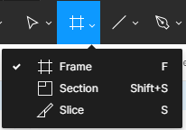
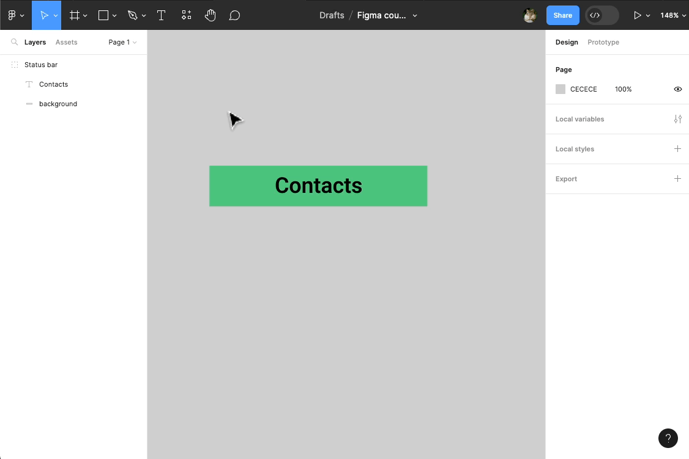
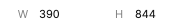
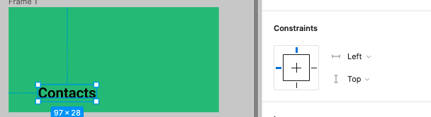
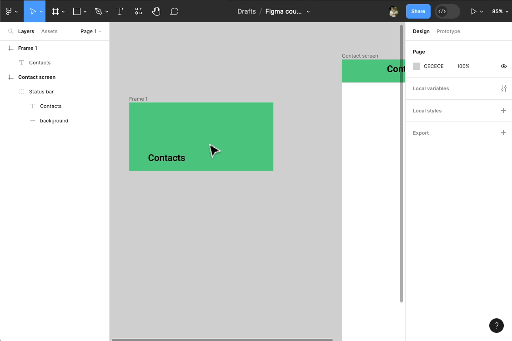

# Frames

Pour créer des écrans dans Figma, on utilise ce qu'on appelle des **Frames**. Ce sont des conteneurs dans lesquels on va placer nos éléments d'interface.

Vous pouvez créer une frame en cliquant sur l'outil **Frame** dans la toolbar.

Dans le design panel, sélectionner un écran de téléphone (ex: iPhone 14)

> **Remarque :** Un écran de téléphone est une frame avec la résolution du modèle (hauteur et largeur en pixels) : 

::: tip Se déplacer dans le plan de travail

Le plan de travail se remplit de plus en plus ? Don't panic !!!

Vous pouvez vous déplacer grâce à l'outil **Hand tool**  ou en maintenant <kbd>Space</kbd> (barre d'espace du clavier)

Utilisez le zoom pour prendre du recul et mieux voir votre travail :
- <kbd>Ctrl</kbd> + Roulette (souris)
- Pavé tactile (ordinateur portable)
:::

On peut maintenant placer notre **Status bar** à l'intérieur de notre frame en la glissant par dessus.

Une fois à l'intérieure, vous pouvez redimensionnez et positionner la **Status bar** en haut de l'écran.

> **Aide :** Vous pouvez utiliser les aides aux positionnements de Figma pour aligner la _Status bar_ en haut à gauche de l'écran, puis redimenssioner directement dans le plan de travail la largeur de celle ci.

Ici on observe un comportement qui ne nous arrange pas : on aimerait que le texte reste centré par rapport au rectangle. Or ici, on remarque que le conteneur du texte s'est agrandit proportionnellement avec le rectangle.

::: tip Groupe VS Frames
Les **Groupes** ne sont pas flexibles (ils possèdent très peu de propriétés), les éléments à l'intérieur sont dépendants du redimensionnement. A l'inverse les **Frames** (sorte de groupes évolués) fournissent plus de contrôle : elles proposent par exemple plusieurs type de contraintes pour les éléments qu'elles contiennent.

Utilisez un(e) :
- **Groupe** - pour un design à court terme (tests utilisateurs, wireframes) qui n'a pas besoin d'une structure flexible (redimensionnements)

- **Frame** - pour un design à long terme (maintenance, évolutions) pour plus de flexibilité (éléments responsives)
:::

Pour mieux saisir la différence entre **Groupes** et **Frames** veuillez recréer une **Status bar** à l'aide d'une frame :

> **Remarque :** Avec une frame, plus besoin d'un rectangle pour mettre un fond de couleur à notre **Status bar**. Il suffit juste de changer la couleur de remplissage de la frame.

Quand on sélectionne un élement dans une frame, on remarque qu'une nouvelle propriété **Constraints** apparait dans le **design panel** à droite.

Ce sont les contraintes de l'élément par rapport à son conteneur (la frame). 

Dans une **Frame**, par défaut, les éléments (exemple : notre texte) ont une contrainte _en haut_ et _à gauche_ : c'est à dire que si on redimensionne notre frame, les élements intérieurs auront toujours une distance fixe par rapport aux bordures _haute_ et _gauche_ de la frame.

Veuillez :
- Recentrer le texte à l'intérieur de la frame.
- Appliquer lui une contrainte centrée en largeur et en hauteur
- Essayer de redimensionnez la frame 🙂

Les **Frames** nous simplifie la vie, notemment lorsque l'on veut designer des écrans responsive (contenu qui s'adapte aux différentes taille d'écran).

Crééons ensemble un écran responsive à partir des éléments dèja présent : 
- Séléctionnez l'ancienne **Status bar** (groupe texte + rectangle) puis supprimez la en pressant la touche <kbd>Back</kbd> du clavier
- Remplacez la par la nouvelle **Status bar** (frame), en la positionnant à l'intérieure de l'écran (frame **Contact screen**)
- Essayez de redimensionner l'écran de téléphone 

On souhaiterai cette fois ci que la nouvelle **Status bar** s'adapte en largeur lorsqu'on redimensionne l'écran : c'est possible, car on a utilisé des frames pour construire nos éléments !!!

Pour celà :
- Faites <kbd>Ctrl</kbd> + <kbd>Z</kbd> pour annuler le redimensionnement de l'écran
- Sélectionnez la **Status bar** puis appliquez lui une contrainte d'échelle (**Scale**) en largeur
- Essayez de redimensionner l'écran 😉

> **Remarque :** Il est donc possible de créer des Frames, dans des Frames, dans des Frames ... 👍

Et pour finir, pensez à bien renommer la Frame (**Status bar**):

