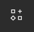

# Icônes

Pour ajouter des icônes à notre design, on pourrait faire comme pour les images : chercher sur internet et importer/copier-coller dans notre plan de travail (tâche relativement fastidieuse).
 
On peut simplifier et accélérer le processus en utilisant un **Plugin** dédié aux icônes !

> **Remarque :** Figma dispose d'un grand nombre de plugins (développés par la communauté) qui peuvent nous aider dans notre design. [Cliquez ici](../plugin.md) pour plus d'informations

Nous allons utiliser le plugin **Iconify** pour chercher et importer nos icônes. Il regroupe les bibliothèques/collections d'icônes les plus connues disponibles sur internet (Google Material Symbols, Bootstrap icons, Feather...).

Pour utiliser ce plugin, faites `Click droit` > `Plugins` > `Manage plugins...`

Une fenêtre s'ouvre. Saisissez **Iconify** dans la barre de recherche, puis cliquez sur le premier résultat.

> **Remarque :** Il est possible d'accéder aux plugins directement depuis l'outil **Ressources**  dans la **Toolbar**

La fenêtre **Iconify** s'affiche, vous pouvez alors :
- Choisir une bibliothèque d'icônes (ex: Google Material Icons) pour avoir des icônes avec le même style graphique (cohérence du design)
- Chercher une icône (ex: phone)
- Sélectionner l'icône de votre choix et cliquer sur **Import icon**

L'icône apparait dans le plan de travail, vous pouvez quitter **Iconify** et placer l'icône dans la **Card**

::: warning Attention
Veuillez bien sélectionner la frame de l'icône (contour) et pas le vecteur directement, lorsque vous la déplacer. La frame est là pour espacer correctement l'icône de ce qui l'entoure.
:::

> **Remarque :** Contrairement à une image (PNG, JPG...), l'icône est vectorielle (**Vector**, voir dans le **panneau de calques** à gauche), il est donc possible de changer sa couleur, et modifier sa taille à l'infinie (sans voir de pixels) !

::: tip Réutiliser un plugin
Enregistrer Iconify en faisant `Click droit` > `Plugins` > `Manage plugins...` puis le bouton **Save** dans les résultats de recherche

Dorénavant  faites `Click droit` > `Plugins` > `Saved plugins` > `Iconify`
:::

> **Remarque :** Il est possible de créer une icône manuellement dans Figma directement avec l'outil Plume (**Pen**) . Il suffit de créer une frame puis de dessiner une forme à l'intérieure.

