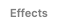
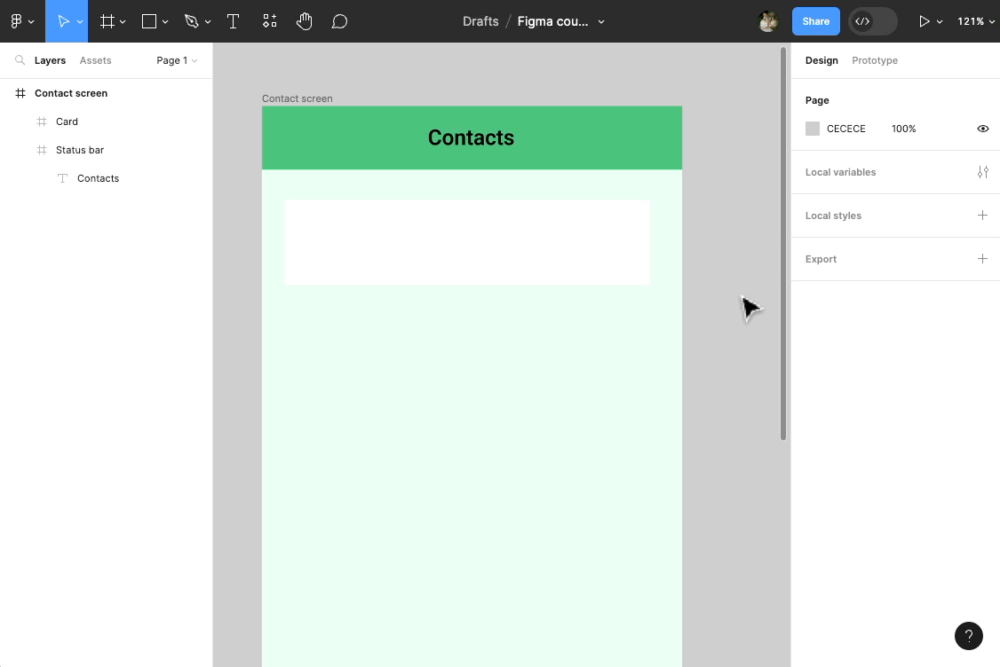
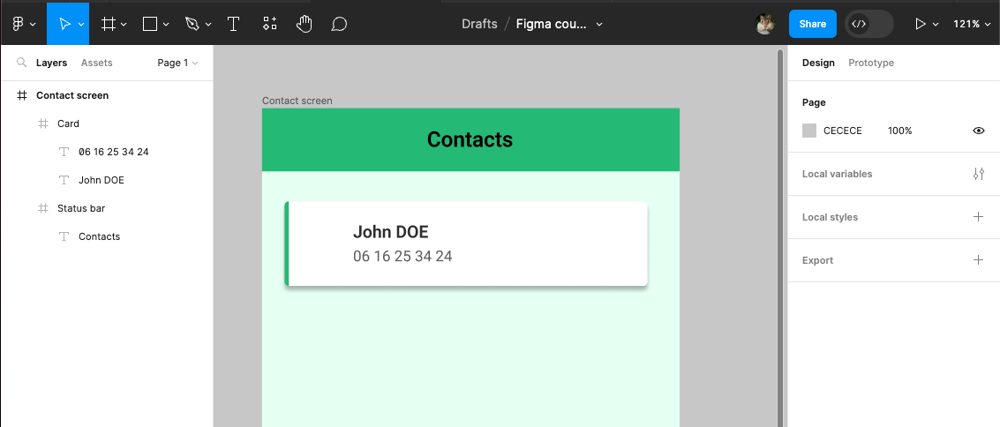

# Autres propriétés

Ensemble, nous allons maintenant créer une liste de contacts. 

Pour se faire il faut maintenant créer l'élement d'interface **Contact** : 

    

**Exercice** :

- Changez la couleur de fond de l'écran **Contacts screen** (ex: vert clair - #ECFFF4)
- Crééez une frame blanche à l'intérieure de l'écran (renommez la en "Card")

- Appliquez à cette **Card** une ombre portée (Panneau de droite > Effects  > Bouton Ajouter  > **Drop Shadow**)

> **Remarque :** Vous pouvez changer les propriétés de cette ombre en cliquant sur 

- Ajoutez une bordure (**Stroke**) à cette card
- Modifiez les propriétés de la bordure :
    - elle ne doit apparaître qu'à gauche de la frame (utilisez )
    - elle doit être de couleur verte (utilisez )
    - elle doit faire 4px d'épaisseur (utilisez )

- Changez les arrondies des angles (**Corner radius**) de la **Card** (ex: 4px)

- Ajouter 2 textes dans la **Card** :
    - un pour le prénom et le nom
    - un autre pour le numéro de téléphone
- Changer les propriétés des textes comme suit :
    - Prénom/nom - **16px** de taille de texte, **24px** de hauteur de ligne (**line-height**), police **Roboto**, épaisseur **semi-bold**, couleur noire foncée **#333333**
    - Numéro - taille de texte **14px**, **21px** de hauteur de ligne, police **Roboto**, épaisseur **regular**, couleur grise **#999999**
- Aligner les textes sur la gauche, et positionner l'un en dessous de l'autre

